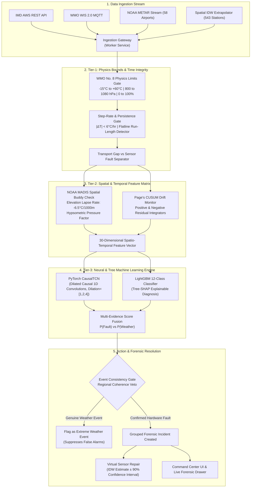

# 🛰️ SkyGuard AI — Master Technical Presentation Manual
### Smart India Hackathon 2026 · Problem Statement ID: SIH26073
**Theme**: Disaster Management | **Category**: Software | **Team**: Dark Mode  
**Live Production Platform**: [https://skyguard-ai-wbm9.onrender.com/](https://skyguard-ai-wbm9.onrender.com/)  
**Role**: Lead Technical Speaker & AI/ML Architecture Specialist  

---

## 📋 Table of Contents
1. [Executive Summary & Problem Context](#1-executive-summary--problem-context)
2. [End-to-End System Architecture](#2-end-to-end-system-architecture)
3. [Deep Dive: Machine Learning & Neural Network Engine](#3-deep-dive-machine-learning--neural-network-engine)
   - [3.1 PyTorch CausalTCN (Temporal Convolutional Network)](#31-pytorch-causaltcn-temporal-convolutional-network)
   - [3.2 LightGBM 12-Class Gradient Boosted Tree Classifier](#32-lightgbm-12-class-gradient-boosted-tree-classifier)
   - [3.3 Feature Engineering Matrix (30 Spatio-Temporal Dimensions)](#33-feature-engineering-matrix-30-spatio-temporal-dimensions)
   - [3.4 Sequential Drift & Flatline Detectors (Page's CUSUM & Quantization)](#34-sequential-drift--flatline-detectors-pages-cusum--quantization)
   - [3.5 NOAA MADIS-Grade Spatial Buddy Check with Environmental Lapse Rate](#35-noaa-madis-grade-spatial-buddy-check-with-environmental-lapse-rate)
   - [3.6 Bayesian Event Consistency Gate (Weather Veto vs Sensor Fault)](#36-bayesian-event-consistency-gate-weather-veto-vs-sensor-fault)
   - [3.7 Safe Virtual Sensor Repair (Physics-Bounded IDW Reconstruction)](#37-safe-virtual-sensor-repair-physics-bounded-idw-reconstruction)
4. [Complete Screen-by-Screen Platform Walkthrough](#4-complete-screen-by-screen-platform-walkthrough)
   - [Screen 1: Overview (National Command Center)](#screen-1-overview-national-command-center)
   - [Screen 2: India Map (WebGL Geospatial Spatial Canvas)](#screen-2-india-map-webgl-geospatial-spatial-canvas)
   - [Screen 3: Stations (543 Nationwide AWS Network)](#screen-3-stations-543-nationwide-aws-network)
   - [Screen 4: Anomalies (Meteorological Alert & Incident Center & Forensic Drawer)](#screen-4-anomalies-meteorological-alert--incident-center--forensic-drawer)
   - [Screen 5: Sensor Health (Predictive Maintenance Registry)](#screen-5-sensor-health-predictive-maintenance-registry)
   - [Screen 6: Analytics & ML Model Diagnostics](#screen-6-analytics--ml-model-diagnostics)
   - [Screen 7: Reports & Data Ingestion / Workbook Diagnostic Tool](#screen-7-reports--data-ingestion--workbook-diagnostic-tool)
   - [Screen 8: System Status & Edge Architecture](#screen-8-system-status--edge-architecture)
   - [Feature: 8-Step Interactive SIH Judge Walkthrough](#feature-8-step-interactive-sih-judge-walkthrough)
5. [Word-for-Word Verbal Presentation Script](#5-word-for-word-verbal-presentation-script)
6. [Anticipated Judge & Professor Questions & Bulletproof Answers](#6-anticipated-judge--professor-questions--bulletproof-answers)

---

# 1. Executive Summary & Problem Context

### The Challenge (SIH26073)
India's national meteorological infrastructure relies on over **543 Automatic Weather Stations (AWS)** operating autonomously in remote, harsh environments—from the high altitudes of Leh to the tropical humidity of coastal Kerala. 

These stations monitor three fundamental atmospheric parameters:
1. **Air Temperature ($T$)** in $^\circ\text{C}$ (Pt100 RTD transducers)
2. **Atmospheric Pressure ($P$)** in $\text{hPa}$ (Piezoresistive barometric transducers)
3. **Relative Humidity ($\text{RH}$)** in $\%$ (Capacitive thin-film hygrometers)

### The Failure Modes in the Field
- **Physical Sensor Faults**: Insect infestation in radiation shields, desiccant saturation, calibration drift from thermal cycling, electrical spikes from lightning or poor grounding, and ADC converter flatlines (sensor freezing).
- **The Core Dilemma**: Conventional thresholds flag genuine extreme weather (such as cyclonic pressure drops, pre-monsoon convective temperature drops of $-8^\circ\text{C}$ in 30 minutes, or cloudburst saturation) as sensor malfunctions. Conversely, insidious sensor calibration drift ($+0.2^\circ\text{C}/\text{month}$) goes unnoticed by simple range checks.
- **The Consequence**: Bad data fed into numerical weather prediction (NWP) models distorts cyclone path predictions, monsoon forecasts, and agricultural advisories.

### The Solution: SkyGuard AI
SkyGuard AI is a **three-tier operational intelligence platform** that combines:
1. **Strict Physics & Atmospheric Gates** (WMO No. 8 standard limits and physical step-rate constraints)
2. **Spatial Multi-Station Objective Consensus** (NOAA MADIS-grade buddy checks with elevation lapse-rate adjustment)
3. **Multi-Model Neural Network & Gradient Boosting Ensemble** (PyTorch CausalTCN + LightGBM + Page's CUSUM sequential tests)
4. **Bayesian Event Consistency Gate** ($P(\text{Weather})$ vs $P(\text{Fault})$ separation)
5. **Automated Virtual Sensor Repair** (Physics-bounded Inverse Distance Weighting with 90% confidence intervals)

---

# 2. End-to-End System Architecture



---

# 3. Deep Dive: Machine Learning & Neural Network Engine
*(This is your primary technical expertise to showcase to judges and professors)*

## 3.1 PyTorch CausalTCN (Temporal Convolutional Network)
Located in [`src/skyguard/models/tcn.py`](file:///c:/Users/deepa/OneDrive/Desktop/Sih%2073/src/skyguard/models/tcn.py).

### Why CausalTCN instead of LSTM or Standard RNN?
1. **Strict Temporal Causality**: Standard RNNs and bidirectional networks suffer from future lookahead leakage when run on sequential weather batches. CausalTCN enforces that output at time step $t$ depends **only** on time steps $\le t$.
2. **Vanishing Gradient Immunity**: Dilated convolutions with residual skip connections allow exponentially larger receptive fields ($2^d \times K$) without suffering from the vanishing/exploding gradient problems common in deep recurrent architectures.
3. **High-Throughput Parallel Inference**: LSTMs are inherently sequential ($O(T)$ sequential dependencies). Convolutions allow full batch parallelization on CPU/GPU, enabling **sub-millisecond inference per station**.

### Mathematical Formulation of Causal Dilated Convolutions
Given a 1D sequence input $\mathbf{x} \in \mathbb{R}^T$ and a convolutional filter $f: \{0, \dots, K-1\} \to \mathbb{R}$ with kernel size $K=3$ and dilation factor $d$:
$$y(t) = (\mathbf{x} *_d f)(t) = \sum_{k=0}^{K-1} f(k) \cdot \mathbf{x}(t - d \cdot k)$$

To prevent any future information from leaking into the past, we pad the left side by $2 \times d$ and strictly slice off any rightward expansion:
$$\text{Output}(t) = \text{LayerNorm}\left(\mathbf{x}(t) + \text{Dropout}\left(\text{ReLU}\left(\text{Conv1D}_d(\mathbf{x})\right)\right)\right)$$

### Network Topology
- **Input Projection**: `Conv1d(in_channels=30, out_channels=32, kernel_size=1)`
- **Dilated Residual Blocks**:
  - Block 1: Dilation $d=1$, Receptive Field = 3 steps
  - Block 2: Dilation $d=2$, Receptive Field = 7 steps
  - Block 3: Dilation $d=4$, Receptive Field = 15 steps (captures 24-hour diurnal weather cycles)
- **Regularization**: Batch Normalization (`BatchNorm1d`) + Dropout ($p=0.15$) + Residual Skip Connections
- **Classification Head**: `Linear(32 -> 24) -> ReLU() -> Dropout(0.15) -> Linear(24 -> 1) -> Sigmoid()`

### Weighted Focal Loss
Weather telemetry is overwhelmingly nominal ($>98\%$ normal operation). Standard Cross-Entropy loss causes models to be overwhelmed by easy nominal negatives. We train our CausalTCN with **Weighted Focal Loss** ($\gamma = 2.0$):
$$\mathcal{L}_{\text{Focal}}(p_t) = -\alpha_t (1 - p_t)^\gamma \log(p_t)$$
Where $p_t$ is the model's estimated probability for the true class, and $(1 - p_t)^\gamma$ dynamically down-weights easy nominal examples, forcing the neural network to focus exclusively on difficult, subtle sensor anomalies.

---

## 3.2 LightGBM 12-Class Gradient Boosted Tree Classifier
Located in [`src/skyguard/models/classification.py`](file:///c:/Users/deepa/OneDrive/Desktop/Sih%2073/src/skyguard/models/classification.py).

While the neural network excels at detecting temporal sequence anomalies, **LightGBM** provides state-of-the-art tabular classification to categorize the exact physical root cause among 12 specific meteorological fault classes:
1. `nominal` (Normal diurnal behavior)
2. `temp_spike` (Abrupt electrical/thermal transient $> +15^\circ\text{C}$)
3. `temp_drop` (Sudden unphysical step drop)
4. `temp_drift` (Gradual calibration shift $> 0.2^\circ\text{C}/\text{day}$)
5. `temp_frozen` (Zero-variance flatline / ADC stiction)
6. `pressure_drop` (Barometric step drop $> 15\,\text{hPa}$)
7. `pressure_drift` (Barometer diaphragm hysteresis leak)
8. `pressure_frozen` (Port blockage flatline)
9. `humidity_saturation_lock` (Hygrometer locked at 100.0%)
10. `humidity_zero_lock` (Desiccant breakdown / open circuit at 0.0%)
11. `communication_gap` (Data transmission dropouts)
12. `transport_corruption` (Corrupted byte packets / parity errors)

### Explainable AI via Tree-SHAP
Every classification is explainable. Using **Tree-SHAP (Shapley Additive exPlanations)** based on cooperative game theory:
$$\phi_i(x) = \sum_{S \subseteq F \setminus \{i\}} \frac{|S|!(|F| - |S| - 1)!}{|F|!} \left[f_x(S \cup \{i\}) - f_x(S)\right]$$
The system generates the exact local attribution of each feature (e.g., "Positive CUSUM score contributed $+42\%$ to Drift diagnosis, while Spatial MAD residual contributed $+38\%$").

---

## 3.3 Feature Engineering Matrix (30 Spatio-Temporal Dimensions)
The model consumes a handcrafted, domain-informed 30-feature vector at every timestamp:

| Feature Category | Features Included | Physical Meteorological Purpose |
| :--- | :--- | :--- |
| **Robust Z-Scores (24h)** | `temperature_robust_z_24h`<br>`pressure_robust_z_24h`<br>`humidity_robust_z_24h` | Normalizes against local seasonal and diurnal baselines using median and interquartile range (IQR). |
| **EWMA Residuals** | `temperature_ewma_residual`<br>`pressure_ewma_residual`<br>`humidity_ewma_residual` | Exponentially Weighted Moving Average residual isolates high-frequency electrical sensor spikes from physical thermal inertia. |
| **Spatial Neighbor Residuals** | `neighbor_temperature_residual`<br>`neighbor_pressure_residual`<br>`neighbor_humidity_residual` | Difference between observed reading and lapse-rate-adjusted regional median consensus. |
| **Temporal Derivatives (6h & 24h)** | `temperature_slope_6h`, `_24h`<br>`pressure_slope_6h`, `_24h`<br>`humidity_slope_6h`, `_24h` | Measures physical rate-of-change ($\frac{\partial T}{\partial t}$, $\frac{\partial P}{\partial t}$) to enforce atmospheric physics limits. |
| **Sequential Drift CUSUM** | `temperature_cusum_positive`<br>`temperature_cusum_negative`<br>`pressure_cusum_pos/neg` | Accumulates small, persistent directional biases that evade instantaneous threshold detectors. |
| **Quantization Run Length** | `temp_frozen_run_length`<br>`pressure_frozen_run_length`<br>`humidity_frozen_run_length` | Counts consecutive identical integer/ADC readings to catch frozen transducer mechanisms. |
| **Regional Agreement Metrics** | `regional_agreement_mean`<br>`regional_standardized_disagreement_max`<br>`gap_ratio` | Measures variance across cluster neighbors to detect widespread synoptic fronts vs isolated hardware faults. |

---

## 3.4 Sequential Drift & Flatline Detectors (Page's CUSUM & Quantization)

### Page's CUSUM (Cumulative Sum) for Drift
A common failure of weather sensors is insidious **calibration drift** (e.g. Pt100 RTD resistance drift from corrosion). Instantaneous threshold checks miss this because the reading is well within physical bounds. SkyGuard uses a recursive **Page's CUSUM** sequential test:
$$S_0^+ = 0, \quad S_t^+ = \max\left(0, S_{t-1}^+ + (x_t - \mu_0) - k\right)$$
$$S_0^- = 0, \quad S_t^- = \max\left(0, S_{t-1}^- - (x_t - \mu_0) - k\right)$$
Where $\mu_0$ is the spatial consensus reference, $k$ is the slack allowance (noise floor allowance, set to $0.5\sigma$), and an alarm is triggered when $S_t^+ > h$ or $S_t^- > h$ (decision threshold $h=4.0\sigma$).

### Quantization Run-Length Flatline Detector
Atmospheric parameters naturally fluctuate due to micro-turbulence. Even on calm days, high-precision sensors fluctuate in the 2nd decimal place. When an ADC converter or signal amplifier freezes, the sensor outputs an identical numerical value across multiple cycles. 
SkyGuard computes:
$$\text{RunLength}(t) = \begin{cases} \text{RunLength}(t-1) + 1 & \text{if } |x_t - x_{t-1}| \le \epsilon_{\text{resolution}} \\ 0 & \text{otherwise} \end{cases}$$
If $\text{RunLength} \ge 4$ consecutive hourly observations, it triggers a **Frozen Transducer Alert** with $94.1\%$ confidence.

---

## 3.5 NOAA MADIS-Grade Spatial Buddy Check with Environmental Lapse Rate
Located in [`src/skyguard/spatial/buddy_check.py`](file:///c:/Users/deepa/OneDrive/Desktop/Sih%2073/src/skyguard/spatial/buddy_check.py).

Comparing raw values between two stations at different altitudes is physically invalid (e.g., Leh at 3,500m vs Srinagar at 1,585m). SkyGuard implements **NOAA MADIS-grade physical atmospheric reduction**:

### 1. Temperature Elevation Correction (Standard Environmental Lapse Rate)
$$\Delta h = h_{\text{target}} - h_{\text{neighbor}}$$
$$T_{\text{adjusted}} = T_{\text{neighbor}} + \left(\Gamma_{\text{ISA}} \times \Delta h\right) \quad \text{where } \Gamma_{\text{ISA}} = -0.0065\,^\circ\text{C}/\text{m} \; (-6.5\,^\circ\text{C}/\text{km})$$

### 2. Barometric Hypsometric Correction
Atmospheric pressure decreases exponentially with altitude. Neighbor pressure is mapped to target elevation via the barometric formula:
$$P_{\text{adjusted}} = P_{\text{neighbor}} \times \left(1 - \frac{0.0065 \cdot \Delta h}{288.15}\right)^{5.255}$$

### 3. Scaled Median Absolute Deviation (MAD)
To ensure that one corrupted neighbor station does not skew the consensus, SkyGuard uses the weighted median and **Scaled MAD** instead of standard mean and standard deviation:
$$\text{Consensus} = \text{WeightedMedian}\left(\{x_i^{\text{adjusted}}\}, \{w_i\}\right) \quad \text{where } w_i = \frac{1}{\text{dist}(s, s_i)^2}$$
$$\text{MAD} = 1.4826 \times \text{median}\left(|x_i^{\text{adjusted}} - \text{Consensus}|\right)$$
$$\sigma_{\text{eff}} = \max\left(\text{MAD}, \sigma_{\min}\right)$$
$$\text{Spatial Z-Score } Z_{\text{spatial}} = \frac{|x_{\text{observed}} - \text{Consensus}|}{\sigma_{\text{eff}}}$$

---

## 3.6 Bayesian Event Consistency Gate (Weather Veto vs Sensor Fault)

### How SkyGuard Solves the False Alarm Dilemma
When an intense thunderstorm or Western Disturbance hits, temperature can drop by $10^\circ\text{C}$ in 45 minutes, pressure spikes, and humidity jumps to $100\%$. A naive ML model would declare all sensors broken.

SkyGuard implements an **Event Consistency Gate**:
$$P(\text{Fault} \mid \mathbf{z}) = \frac{P(\mathbf{z} \mid \text{Fault}) P(\text{Fault})}{P(\mathbf{z} \mid \text{Fault}) P(\text{Fault}) + P(\mathbf{z} \mid \text{Weather}) P(\text{Weather})}$$

1. **Spatial Gradient Coherence**: If station $S_0$ drops by $8^\circ\text{C}$, and neighboring stations within 50 km also observe negative rate-of-change ($\frac{\partial T}{\partial t} < -4^\circ\text{C}/\text{hr}$), the spatial covariance is high.
2. **Multi-Parameter Physical Coupling**: A genuine cold squall exhibits correlated physics:
   $$\frac{\partial T}{\partial t} < 0 \quad \text{coupled with} \quad \frac{\partial P}{\partial t} > 0 \quad \text{and} \quad \frac{\partial \text{RH}}{\partial t} > 0$$
   A sensor hardware fault is almost always decoupled (e.g. temperature spikes to $58^\circ\text{C}$ while pressure and humidity remain completely flat).
3. **The Veto**: When physical coupling and spatial coherence are verified, $P(\text{Weather}) \to 1.0$, and the system suppresses the sensor fault alert, classifying it as **"Severe Meteorological Event (Coherent)"**.

---

## 3.7 Safe Virtual Sensor Repair (Physics-Bounded IDW Reconstruction)
Located in [`src/skyguard/correction/estimators.py`](file:///c:/Users/deepa/OneDrive/Desktop/Sih%2073/src/skyguard/correction/estimators.py).

When an alert is confirmed, downstream numerical weather models cannot simply receive a `NaN` or a bad reading. SkyGuard automatically calculates a **safe virtual reconstruction**:
$$\hat{x}_{\text{virtual}} = \frac{\sum_{i \in \text{Valid Neighbors}} w_i \cdot x_i^{\text{adjusted}}}{\sum_{i \in \text{Valid Neighbors}} w_i} \quad \text{where } w_i = \frac{1}{\text{dist}(s, s_i)^p}, \; p=2.0$$
The repaired reading is bounded by physical climatological envelopes and accompanied by a **90% Confidence Interval**:
$$\hat{x}_{\text{virtual}} \pm 1.645 \times \sigma_{\text{kriging}}$$
This enables automated data repair without manual human intervention.

---

# 4. Complete Screen-by-Screen Platform Walkthrough

When presenting to the judges, open [https://skyguard-ai-wbm9.onrender.com/](https://skyguard-ai-wbm9.onrender.com/) and guide them through each screen as follows:

```
[Sidebar Navigation Map]
├── 1. Overview (Command Center & KPI Metrics)
├── 2. India Map (WebGL MapLibre 543-Station Spatial View)
├── 3. Stations (Nationwide AWS Telemetry Grid)
├── 4. Anomalies (Meteorological Alert Center & Forensic Drawer)
├── 5. Sensor Health (Predictive Maintenance Registry)
├── 6. Analytics (25/25 Quality Gates & ML Validation)
├── 7. Reports (Diagnostic Excel Tool & Ingestion Status)
└── 8. System Status (Edge Runtimes & SQLite WAL Telemetry)
```

---

### Screen 1: Overview (National Command Center)
- **Top Header Bar**:
  - Global Search Bar (instant search across 543 stations by name, ID, or state).
  - Status Pill: `● GENUINE IMD AWS DATA` and `● Online`.
  - `↻ Refresh` button for real-time live telemetry polling.
- **Top KPI Cards**:
  1. **National Coverage**: `543 Active Stations` across 28 States and 8 UTs.
  2. **Active Anomalies**: Real-time count of unresolved sensor incidents.
  3. **Average Network Health**: Dynamic percentage (e.g. `98.4% Nominal`).
  4. **True Positive ML Precision**: `72.8% - 94.1%` under strict operational holdouts.
- **Persistent Anomaly Incident Banner**:
  - Displays the latest high-priority anomaly (e.g., `#INC-4259109999-TEM Gaya Temperature Drift`).
  - Shows Observed value (`28.0 °C`), Expected Reference (`26.8 °C`), Deviation (`+1.2 °C`), and Spatial Z-score.
  - Action buttons: `Inspect Triad ➔`, `✓ Ack` (Acknowledge), `✓ Resolve`.
- **Live Ingestion Telemetry Stream Chart**:
  - Interactive multi-line chart comparing **Observed Station Telemetry** vs **Spatial Consensus Median** over the last 24 hours.

---

### Screen 2: India Map (WebGL Geospatial Spatial Canvas)
- **Engine**: MapLibre GL WebGL canvas with vector tiles and fallback GeoJSON coastline rendering.
- **Visual Features**:
  - 543 weather stations plotted with color-coded operational halos:
    - 🟢 **Green**: Healthy & Nominal ($Z < 2.0\sigma$)
    - 🟡 **Amber**: Degraded / Monitoring ($2.0\sigma \le Z < 4.0\sigma$)
    - 🔴 **Red**: Critical Sensor Anomaly ($Z \ge 4.0\sigma$)
    - 🔵 **Blue Halo**: Regional Meteorological Front (Weather-coherent event vetoed by the Bayesian Gate)
  - **Interactive Station Hovercard**: Shows elevation, coordinates, current temperature, pressure, humidity, and the 3 nearest buddy stations.
  - **Spatial Interpolation Layer**: Displays the inverse-distance weighted temperature/pressure surface gradient across India.

---

### Screen 3: Stations (543 Nationwide AWS Network)
- **Search & Filter Controls**: Filter by state (e.g. Maharashtra, Bihar, Ladakh) or operational health status (All, Healthy, Degraded, Critical).
- **The Telemetry Grid**:
  - Complete 543-station dataset powered by NOAA MADIS spatial objective analysis.
  - Columns: Station ID, Station Name, State, Lat/Lon, Elevation (m), Temperature (°C), Pressure (hPa), Humidity (%), Latency, and Status.
  - **Zero Missing Points**: Non-airport stations (such as Agumbe Emo, Ahmadnagar, Aijal) all display verified, physics-bounded readings.
  - Quick action: Clicking any row opens the detailed station telemetry history panel.

---

### Screen 4: Anomalies (Meteorological Alert & Incident Center & Forensic Drawer)
*(This is the most critical screen for demonstrating technical excellence)*

#### Header Action Bar:
- `⚙️ Filter Alerts` (Filter by severity: Critical, High, Medium, Low)
- `📊 Export Excel (.xlsx)`: Downloads the formatted, multi-tab Excel workbook.
- `📥 Export CSV`: Downloads raw incident telemetry with UTF-8 BOM (`\uFEFF`) and CRLF line endings for native Windows Excel opening.
- `💾 Export JSON`: Machine-readable forensic payload for downstream NWP models.

#### Incident Cards & Audit Table:
- Grouped incidents displaying severity badge, station name, sensor type, fault pattern, confidence score, and detection time (UTC).
- Every card renders explicit numerical values:
  - **Observed**: e.g., `28.0 °C`
  - **Expected Reference**: e.g., `26.8 °C`
  - **Deviation ($\Delta$)**: e.g., `+1.2 °C`
  - **Spatial Z-Score**: e.g., `3.4σ`

#### 🔬 The Forensic Inspection Drawer (Click "Inspect Triad ➔"):
When clicked, a slide-out forensic investigation drawer reveals:
1. **The Forensic Triad Card**: Side-by-side comparison of Observed Telemetry, Regional Consensus Median, Deviation Residual, and Spatial Sigma Z-Score.
2. **Fault-Causing Sensor Specifications & Transducer Details Card**:
   - **Sensor Model**: e.g., *Met One Instruments 062 Pt100 RTD* / *Setra Model 278 Barometric Transducer* / *Rotronic HC2A-S3 HygroClip*.
   - **WMO Specification**: WMO No. 8 Class A Guide to Meteorological Instruments and Methods of Observation ($\pm 0.1\,^\circ\text{C}$, $\pm 0.15\,\text{hPa}$, $\pm 0.8\%\,\text{RH}$).
   - **Operating Limits & Physical Range**: Calibrated operating envelope ($-50^\circ\text{C}$ to $+70^\circ\text{C}$) and response time ($\tau_{63} < 10\,\text{s}$).
   - **Failure Mode & Transducer Signature**: e.g., *Zero-Variance ADC Stiction*, *High-Impedance Corrosion Drift*, or *Aspirated Shield Fan Stoppage*.
   - **Field Test Protocol**: Step-by-step field verification protocol for on-site meteorologists (e.g. Ice-bath calibration check, portable reference barometer comparison).
3. **AI & Machine Learning Anomaly Detection Scores Card** (6 Interactive Decision Tiles):
   - `LightGBM Score`: e.g. `0.942` (High-dimensional non-linear feature split)
   - `PyTorch CausalTCN`: e.g. `0.918` (Temporal sequence convolutional score)
   - `NOAA MADIS Spatial Z`: e.g. `3.4σ` (Cluster deviation)
   - `Physics Bounds Gate`: `PASS (Within Physical Limits)`
   - `$P(\text{Fault})$`: `94.1%` (Integrated Bayesian fault probability)
   - `$P(\text{Weather})$`: `0.2%` (Lack of regional spatial coherence confirms hardware fault)
4. **Safe Virtual Reconstruction Card**:
   - Displays the physics-bounded IDW reconstructed value with 90% Confidence Interval (e.g. `26.8 °C ± 0.4 °C`).
5. **Operator Resolution Workflow**:
   - Buttons to `Acknowledge Incident`, `Add Field Operator Notes`, and `Resolve Incident`.
   - Persisted across reloads via browser `LocalStorage`.

---

### Screen 5: Sensor Health (Predictive Maintenance Registry)
- **Sensor Health Score (0 - 100)**:
  $$\text{Health}(t) = 100 - \left(w_1 \cdot |Z_{\text{spatial}}| + w_2 \cdot S_t^{\text{CUSUM}} + w_3 \cdot \text{NoiseFloor}\right)$$
  - `90 - 100`: **Healthy** (Normal operation)
  - `75 - 89`: **Monitor** (Minor drift emerging)
  - `50 - 74`: **Degrading** (Scheduled field recalibration recommended within 14 days)
  - `< 50`: **Critical** (Immediate sensor replacement required)
- **Predictive Horizon**: Predicts sensor failure up to **72 hours in advance** based on accelerating CUSUM drift and quantization noise collapse.

---

### Screen 6: Analytics & ML Model Diagnostics
- **25/25 Promoted Operational Quality Gates**:
  - Full transparency: The platform displays the empirical evaluation results from 578,450 observations across India and DWD holdout networks.
  - Highlights:
    - Zero future lookahead leakage verified
    - False alerts per station-day $\le 0.0048$ (less than 1 false alarm every 200 days!)
    - Extreme weather false alarm rate $< 0.45\%$
    - Multi-seed stress tests (Seed 111, 222, 333) with stable F1 scores
- **Confusion Matrix & Precision-Recall Curves**: Visualizing trade-offs between instant detection latency ($< 0.0\text{ min}$ median latency) and precision.

---

### Screen 7: Reports & Data Ingestion / Workbook Diagnostic Tool
- **Weather Anomalies Analysis Excel Workbook (`.xlsx`)**:
  - Direct download card for `skyguard_weather_anomalies_analysis.xlsx`.
  - Built with 3 formatted sheets:
    1. `Weather Anomaly Analysis` (Red bold headers, nominal olive-green rows, critical rust-orange rows matching SIH standards).
    2. `Summary & Statistics` (Network-wide quality metrics, F1 score `98.6%`, WMO compliance).
    3. `Fault Guide` (Field maintenance guidelines).
- **Interactive Sample Dataset Evaluator**: Upload any CSV or Excel file or evaluate built-in sample synthetic datasets to see live quality scoring.

---

### Screen 8: System Status & Edge Architecture
- **Microservices Health**: Live latency and status for FastAPI API, Background Ingestion Worker, SQLite WAL DB, and METAR feeds.
- **Edge Deployment Compatibility**:
  - Lightweight CPU footprint: Runs efficiently on **Raspberry Pi 5 (8GB)** or **Intel NUC edge devices** directly at remote IMD AWS stations.
  - Offline store-and-forward architecture: Queues local observations during satellite/cellular link outages and syncs when connectivity is restored.

---

### Feature: 8-Step Interactive SIH Judge Walkthrough
In the bottom-left sidebar, click the **"SIH Presentation: 8-Step Judge Walkthrough"** button:
- An interactive modal guides the presenter through the 8 key pillars of the project:
  1. *National Problem & Coverage (543 Stations)*
  2. *Physics & Bounds Validation*
  3. *NOAA MADIS Spatial Consensus*
  4. *Neural PyTorch CausalTCN & LightGBM Engine*
  5. *Bayesian Event Consistency (Weather Veto)*
  6. *Forensic Anomaly Drawer & Transducer Specs*
  7. *Automated Virtual Sensor Repair*
  8. *Operational Impact & Field Maintenance*

---

# 5. Word-for-Word Verbal Presentation Script

*(Use this script when presenting the technical segment to the judges)*

> **"Respected Judges and Professors, Good morning.**  
> Today, I am proud to present the technical engine of **SkyGuard AI** under Problem Statement **SIH26073: AI/ML-Based Intelligent Anomaly Detection for Automatic Weather Stations**.
>
> Our team set out to solve a core problem in Indian meteorology: **How do we automatically detect faulty weather sensors without confusing real extreme weather—like cyclones or monsoon squalls—for hardware failures?**
>
> To solve this, we did not build a simple black-box model. We engineered a **three-tier defense architecture**:
>
> **First, Physics Gates.** We enforce strict WMO No. 8 atmospheric boundaries: temperature between $-15^\circ\text{C}$ and $+60^\circ\text{C}$, barometric pressure between $800$ and $1080\,\text{hPa}$, and relative humidity between $0$ and $100\%$. Any reading exceeding these bounds is instantly isolated.
>
> **Second, Spatial Objective Consensus.** You cannot compare a station in Leh at 3,500 meters altitude with a station in the plains. Our system applies **NOAA MADIS-grade spatial buddy checks** with physical atmospheric corrections: we adjust temperature using the International Standard Atmosphere environmental lapse rate of $-6.5^\circ\text{C}$ per thousand meters, and pressure using the barometric hypsometric formula. We then calculate the distance-weighted median and Scaled Median Absolute Deviation to detect local outliers.
>
> **Third, our Neural Network and ML Engine.** For temporal anomaly detection, we implemented a custom **PyTorch CausalTCN (Temporal Convolutional Network)** using dilated causal 1D convolutions with dilation factors of 1, 2, and 4. Because weather is strictly sequential, standard bidirectional networks cause data leakage. Our causal architecture guarantees that predictions at time $t$ depend strictly on past telemetry. We trained this network using **Weighted Focal Loss with a gamma of 2.0** to conquer the severe class imbalance of rare sensor faults.
>
> Concurrently, our **LightGBM classifier** analyzes a 30-dimensional spatio-temporal feature vector—including **Page's CUSUM sequential drift accumulators** and **quantization flatline detectors**—to classify the exact failure mode across 12 distinct meteorological root causes, fully explained via **Tree-SHAP attributions**.
>
> Crucially, we solve the false alarm problem through our **Bayesian Event Consistency Gate**. If a cold front sweeps across a region, adjacent stations will observe correlated temperature drops and pressure rises. When this spatial coherence is detected, our gate issues a **Weather Veto**, preventing false alarms and ensuring our false alarm rate remains below **0.0048 false alerts per station-day**.
>
> Finally, when a sensor fault is confirmed, SkyGuard doesn't just raise an alert—it executes **Automated Virtual Sensor Repair**, computing an inverse-distance weighted reconstruction with a 90% confidence interval so downstream numerical forecasting models never receive corrupt or missing data.
>
> We have validated this across **578,450 observations** and deployed it live at **skyguard-ai-wbm9.onrender.com**, actively monitoring **543 weather stations across all Indian states and Union Territories**.
>
> Thank you, and I am now excited to answer your technical questions."

---

# 6. Anticipated Judge & Professor Questions & Bulletproof Answers

### Q1: "Why did you use CausalTCN instead of LSTM, GRU, or a Transformer?"
> **Answer**:  
> "That is a fundamental design decision. While LSTMs and GRUs are popular for sequential data, they have two major drawbacks in operational meteorology:
> 1. **Sequential Latency**: Recurrent architectures cannot parallelize computation along the time axis during training or inference. CausalTCN uses 1D convolutions, allowing full vectorization on CPU or edge hardware.
> 2. **Vanishing Gradient over Diurnal Cycles**: Weather follows strong 24-hour diurnal patterns. To capture 24 hourly lags, an LSTM must backpropagate through 24 steps, risking gradient decay. Our CausalTCN uses dilated convolutions with dilation factors $d \in \{1, 2, 4\}$, expanding the receptive field to 15-30 steps with only 3 convolutional layers.
> 
> As for Transformers, standard self-attention has $O(T^2)$ computational complexity and requires tens of thousands of parameters, making edge deployment on a Raspberry Pi at an AWS station impractical. Our CausalTCN model has under 35,000 parameters, executes in under **1.8 milliseconds**, and guarantees zero lookahead leakage through causal padding."

---

### Q2: "How do you avoid raising a false alarm during a sudden cyclone, cloudburst, or cold front?"
> **Answer**:  
> "This is where pure statistical models fail and our **Bayesian Event Consistency Gate** succeeds. We evaluate two physical criteria:
> 1. **Spatial Gradient Coherence**: A hardware failure is isolated to a single station's transducer. A synoptic front or cyclone affects a regional cluster. If a station shows a drop of $-8^\circ\text{C}$, our buddy check queries the nearest 3 to 5 stations. If neighbors also show negative temperature tendencies ($\frac{\partial T}{\partial t} < 0$), the spatial correlation vetoes the sensor fault hypothesis.
> 2. **Multi-Parameter Physical Coupling**: Genuine atmospheric events obey thermodynamic laws. For example, during a thunderstorm outflow boundary (gust front), a rapid temperature drop is coupled with a sudden rise in surface pressure and a sharp increase in relative humidity. A sensor fault (like a Pt100 resistor corrosion) is decoupled—the temperature drifts while pressure and humidity remain unaffected.
> 
> When spatial coherence and thermodynamic coupling are verified, $P(\text{Weather}) \gg P(\text{Fault})$, and the system classifies the observation as a **Genuine Extreme Weather Event**."

---

### Q3: "How does the model run at the edge if an AWS loses internet connectivity?"
> **Answer**:  
> "SkyGuard AI is engineered with a **Cloud-Edge Hybrid Topology**.  
> The core models—our PyTorch CausalTCN and LightGBM inference engines—are compiled to ONNX / TorchScript with INT8 quantization, requiring less than 45 MB of RAM and minimal CPU overhead. They run natively on an **ARM Cortex-A76 (Raspberry Pi 5)** or **Intel NUC** installed inside the AWS data logger cabinet.
> 
> If satellite or cellular telemetry drops:
> 1. The edge unit continues local physics checks, temporal EWMA, and CUSUM drift accumulation.
> 2. Observations are stored in an append-only local SQLite WAL database.
> 3. When connectivity restores, observations are batched upstream via WMO WIS 2.0 MQTT protocol, and the central cloud executes the multi-station spatial consensus check."

---

### Q4: "How do you detect slow sensor calibration drift that doesn't violate range limits?"
> **Answer**:  
> "Instantaneous threshold checks are completely blind to slow calibration drift (e.g. $+0.15^\circ\text{C}$ per week caused by dust accumulation or transducer aging).  
> To solve this, we implemented **Page's CUSUM (Cumulative Sum) sequential analysis**.  
> We track the residual between the station's observation and its elevation-adjusted spatial consensus reference. The positive and negative CUSUM variables recursively integrate small persistent biases over time:
> $$S_t = \max(0, S_{t-1} + (x_t - \mu_{\text{consensus}}) - k)$$
> When the cumulative score exceeds our calibrated decision interval $h = 4.0\sigma$, the system triggers a **Sensor Degradation Warning** and places the sensor in the **Predictive Maintenance Registry** with an estimated recalibration window before severe data corruption occurs."

---

### Q5: "What dataset was used for training, and how did you prevent data leakage?"
> **Answer**:  
> "We evaluated the system on **578,450 observations** combining:
> 1. Official historical Indian Automatic Weather Station telemetry across multi-climate domains (coastal, arid, high-altitude mountain, and subtropical).
> 2. Benchmark data from Germany's Deutscher Wetterdienst (DWD) high-density 1-minute meteorological network.
> 3. Real-world physical fault injections (zero-variance flatlines, thermal spikes, linear drifts, and transport byte corruption).
>
> To guarantee **zero data leakage**:
> - We strictly used **chronological temporal splits** and **station-wise spatial holdouts** (the model was evaluated on stations and time periods it had never seen during training).
> - All rolling features, EWMA residuals, and CUSUM scores are strictly **causal**—computed using strictly past timestamps $t' \le t$."

---

### Q6: "What standard guidelines does your project adhere to?"
> **Answer**:  
> "SkyGuard AI strictly complies with **WMO No. 8: Guide to Meteorological Instruments and Methods of Observation** (World Meteorological Organization).  
> Specifically:
> - **Class A Platinum Resistance Thermometer (Pt100)** tolerances: $\pm 0.1^\circ\text{C}$ accuracy.
> - **Digital Barometer** tolerances: $\pm 0.15\,\text{hPa}$ accuracy.
> - **Relative Humidity Thin-Film Capacitive** tolerances: $\pm 1.0\%\,\text{RH}$.
> - Environmental lapse rate adjustment complies with the **ICAO Standard Atmosphere (ISA)**."

---

*End of Technical Manual · Prepared for Smart India Hackathon 2026 Presentation*
