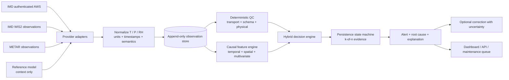
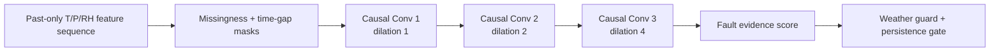
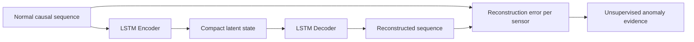
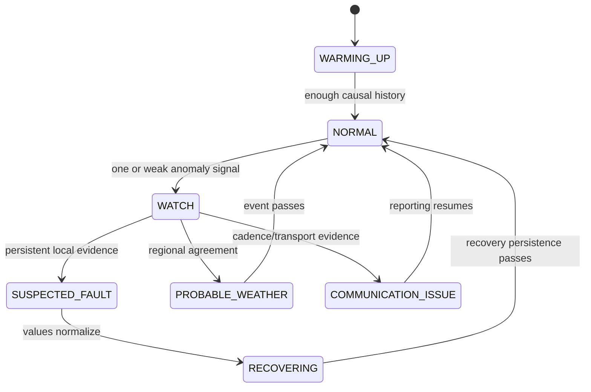
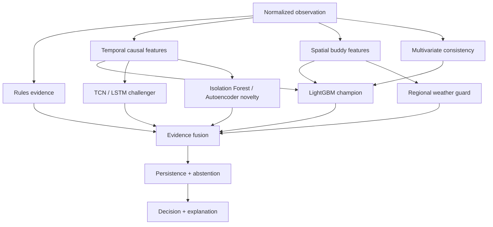
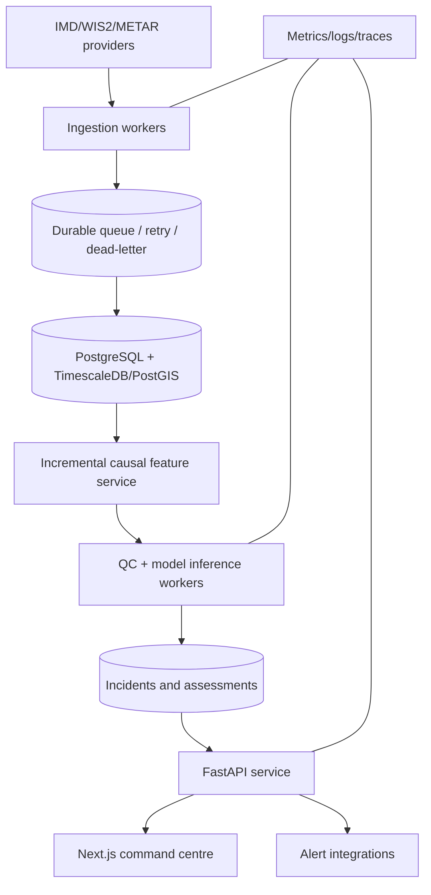

# SkyGuard AI — SIH26073 PPT Master Guide

**Presentation-ready master document | Easy Hinglish (Roman Hindi)**  
**Evidence cut-off:** 13 September 2026  
**Project:** SkyGuard AI — Intelligent Real-Time Anomaly Detection for Automatic Weather Stations  
**Problem Statement:** SIH26073  

---

## 0. Sabse pehle: is document ko kaise use karein

Yeh file team ko SIH presentation, speaking script, architecture diagram, demo aur judge Q&A banane ke liye single source of truth deti hai. Isme numbers directly repository ke audited result files se liye gaye hain. Jahan system abhi research-stage ya blocked hai, wahan limitation clearly likhi gayi hai.

### Presentation truth rules

1. **543 stations = live AWS stations nahi hain.** Yeh NOAA/ISD Indian station metadata catalog ke coordinate-bearing rows hain.
2. **432 = official IMD WIS2 metadata rows**, lekin sab stations har time live report nahi karte.
3. **Historical verified India ML development data = 24 stations, 385,656 rows, 2022–2023.**
4. **Live dashboard par jo value source se nahi aayi, use generate ya guess nahi karna.** Missing ko `Not reported` dikhana hai.
5. **Overall accuracy ko headline metric nahi banana.** Dataset highly imbalanced hai; precision, recall, F1, AUCPR, episode recall aur false alarms important hain.
6. **Phase 10 metrics injected-fault historical evaluation par hain**, verified real IMD maintenance labels par nahi.
7. **TCN aur LSTM Autoencoder research challengers hain.** TCN automatic alert path mein promote nahi hua; LSTM Autoencoder production model nahi hai.
8. **Current public live layer operational causal QC chalata hai.** Offline trained model ko IMD-domain calibration aur independent labels ke bina certified operational model nahi bolna.

> **Recommended PPT claim:** “SkyGuard AI is a working, provenance-aware AWS quality-control platform with a verified offline ML baseline and a live causal monitoring pipeline. IMD-authenticated temporal history and real fault labels are the remaining production-validation requirements.”

---

## 1. One-line answer: SkyGuard AI kya hai?

**SkyGuard AI ek hybrid, explainable aur real-time weather-station quality-control system hai jo sirf Temperature, Atmospheric Pressure aur Relative Humidity se sensor fault, genuine extreme weather aur communication problem ko alag karta hai; phir alert, likely root cause, sensor-health evidence aur safe correction suggestion deta hai.**

### 15-second elevator pitch

“Traditional threshold system extreme weather ko bhi fault samajh sakta hai. SkyGuard AI ek reading ko akela judge nahi karta—woh station ki past history, neighbouring stations, parameter relationships aur communication quality ko combine karta hai. Isliye system `normal`, `genuine weather`, `suspected sensor fault`, ya `insufficient evidence` decision deta hai, aur har alert ka reason batata hai.”

### Tagline options

- **Trust every weather reading.**
- **From raw observations to trustworthy decisions.**
- **Detect the fault. Preserve the weather. Explain the decision.**

---

## 2. SIH26073 problem ko simple language mein samjhein

Automatic Weather Stations continuously temperature, pressure aur humidity observe karti hain. Harsh environment, calibration drift, power issue, sensor aging, packet corruption aur communication failure ki wajah se wrong readings aa sakti hain. Agar bad data forecasting ya disaster-management system tak pahunch jaye, toh decision quality affect ho sakti hai.

Lekin main challenge sirf “unusual value pakadna” nahi hai. System ko yeh decide karna hai:

- Kya 47°C genuine heatwave hai ya faulty temperature sensor?
- Kya rapidly falling pressure cyclone/front ka sign hai ya pressure-sensor drift?
- Kya same value 20 baar aana stable weather hai ya frozen sensor?
- Kya data na aana hardware failure hai, network delay hai, ya scheduled reporting gap?
- Kya ek station unusual hai, ya poora neighbouring region ek real weather event dekh raha hai?

### Core design principle

> **“Anomaly” aur “sensor fault” same cheez nahi hain.**  
> Anomaly unusual observation hai. Sensor fault tab maana jayega jab temporal, spatial, physical aur transport evidence us conclusion ko support kare.

---

## 3. Proposed PPT structure — 18 slides

Har slide ke neeche `On-slide content`, `Visual` aur `Speaker note` diya gaya hai. Team 10-minute presentation ke liye 14–16 slides rakh sakti hai; short round ke liye marked optional slides hata sakti hai.

---

### Slide 1 — Title

**On-slide content**

- SkyGuard AI
- Intelligent Real-Time Anomaly Detection for Automatic Weather Stations
- SIH26073 · Disaster Management
- “Detect the fault. Preserve the weather. Explain the decision.”
- Team/institute details team khud add kare.

**Visual**

Light India map, station nodes aur ek highlighted incident. Background subtle animated pressure contours ya flowing data particles ho sakte hain.

**Speaker note**

“Namaste. SkyGuard AI ka goal har weather reading par blind trust karna nahi, balki har reading ki reliability ko evidence ke saath measure karna hai.”

---

### Slide 2 — Why this problem matters

**On-slide content**

- AWS data supports forecasting, aviation, agriculture, disaster response and research.
- Sensor faults can create spikes, drift, frozen values, missing packets and corrupted data.
- Bad observations can contaminate downstream decisions.
- Static min/max rules cannot understand season, location, trend or neighbours.

**Visual**

One pipeline: `Faulty sensor → Wrong observation → Forecast/alert system → Operational risk`.

**Speaker note**

“Ek faulty sensor ka number small lag sakta hai, lekin wahi number numerical models, warnings aur operational dashboards mein multiply hota hai. Isliye input quality control first line of defence hai.”

---

### Slide 3 — The hardest scientific question

**On-slide content**

| Case | Same unusual reading ka possible meaning |
|---|---|
| One station jumps, neighbours stable | Probable local sensor fault |
| Many neighbours change together | Probable genuine weather event |
| Value repeats unnaturally | Possible frozen sensor |
| Reports stop arriving | Communication gap; not automatically hardware fault |
| New station has little history | Warm-up / insufficient evidence |

**Visual**

Split screen: local red spike versus regional coordinated weather front.

**Speaker note**

“SkyGuard ka innovation ek high value ko fault bolna nahi hai. Innovation yeh hai ki system local inconsistency aur regional consistency ko alag evaluate karta hai.”

---

### Slide 4 — Our solution in one view

**On-slide content**

1. Genuine observation ingestion with provenance
2. Schema, transport and physical checks
3. Causal temporal analysis
4. Same-time/backward neighbour consistency
5. Hybrid ML + unsupervised + neural evidence
6. Multi-reading incident state machine
7. Explainable alert, root cause, health and optional correction

**Visual — use this architecture**



**Speaker note**

“Humne data source se dashboard tak complete path banaya hai. Raw observation overwrite nahi hota; assessment aur correction suggestion separate audit records rehte hain.”

---

### Slide 5 — Data strategy: catalog, observations and labels are different

**On-slide content**

| Data asset | Audited scope | Actual role | Important limitation |
|---|---:|---|---|
| India historical NOAA/NCEI ISD proxy | 385,656 rows, 24 stations, 2022–2023 | Main India-domain development data | RH derived; mixed pressure semantics; faults injected, not maintenance-confirmed |
| DWD 10-minute observations | 838,126 rows/16 stations in 2022 + 838,307 rows/16 stations in 2023 | Rich cadence transfer/pretraining and stress testing | German climate and network domain differ from India |
| NOAA/ISD India catalog | 545 metadata IDs, 543 with coordinates | National station discovery/map catalog | Metadata is not proof of live reporting or training usability |
| Official IMD WIS2 registry | 432 metadata rows in audited snapshot | Official public observation/metadata path | Live reporting is sparse and window-dependent |
| IMD WIS2 24-hour audit | 1,414 reports from 321 reporting stations in that audit window | Direct observation coverage proof | Snapshot, not permanent coverage or fault-labelled dataset |
| AviationWeather METAR | Airport observations | Supplementary live direct observations | Limited station coverage; RH commonly derived from T/dew point |
| Authenticated IMD AWS API | Requested production source | Intended best national live source | Credentials/history not available in repository yet |
| Open-Meteo or other NWP | Gridded model field | Independent weather context only | Never presented as a sensor observation |

**Speaker note**

“543 ko hum live station count nahi bolte. Station catalog batata hai station kahan ho sakte hain. Live coverage batata hai kaun abhi report kar raha hai. Training set batata hai kis history par model actually learn hua. Ye scientific separation humari credibility strong banati hai.”

---

### Slide 6 — Why India and DWD results differ

**On-slide content**

- DWD cadence regular 10-minute hai; India proxy mein 30-minute aur 180-minute cadence mix hai.
- DWD rows complete aur consistent hain; India proxy mein reporting gaps aur missing fields hain.
- India pressure data mein sea-level pressure, altimeter/QNH aur station pressure mix ho sakte hain.
- Historical India RH temperature/dew point se derived hai, direct RH sensor fault ka perfect proxy nahi.
- India training coverage sirf 24 stations thi; unseen climate/station generalization difficult hai.
- Real sensor maintenance/failure labels absent hain, isliye controlled fault injection use hui.

**Visual**

Two-column comparison: `DWD = dense and regular`, `India proxy = sparse and heterogeneous`.

**Speaker note**

“DWD se temporal pattern learn karna easy hai, lekin DWD accuracy ko India deployment accuracy nahi bol sakte. Transfer learning tab useful hai jab final calibration Indian station history par ho.”

---

### Slide 7 — Three-input contract and 108 causal features

**On-slide content**

Raw detector inputs strictly:

- Temperature (°C)
- Pressure (hPa), with pressure type preserved
- Relative Humidity (%)

In teen parameters se 108 engineered features bante hain:

- Lag, delta and rate of change
- Rolling median, MAD and robust z-score
- Prior EWMA residual
- Frozen run length
- 3h/6h/12h/24h slopes
- Positive and negative CUSUM drift
- Neighbour median, residual and agreement
- Regional trend agreement
- Missingness, cadence gap and out-of-order indicators
- Climate/station-normalized residuals

**Causality rule**

`Feature at time t = current reading + only observations with time <= t`  
Future data never enters the current decision baseline.

**Speaker note**

“Model ko station name ya future answer leak nahi kiya jata. Calendar/dew-point shortcuts detector input nahi hain. Station coordinates routing ke liye ho sakte hain, fourth meteorological sensor input nahi.”

---

### Slide 8 — Multi-evidence technical approach

**On-slide content**

| Evidence layer | Kya check hota hai | Kis problem ko solve karta hai |
|---|---|---|
| Transport/schema | Missing packet, duplicate, out-of-order, parse/unit issue | Communication/data corruption |
| Physical | Impossible or unsafe T/P/RH range | Gross sensor/unit errors |
| Temporal | Station ki apni causal history se deviation | Spike, freeze, bias, drift, noise |
| Multivariate | T–RH and T–P behaviour | Cross-sensor inconsistency |
| Spatial buddy | Nearby stations se same-semantics comparison | Local fault vs regional weather |
| Persistence | Multiple recent observations ka agreement | One-point false alarms kam karta hai |
| Abstention | Evidence insufficient ho toh no forced verdict | New/sparse station safety |

**Speaker note**

“Ek layer fail ho sakti hai; isi liye final decision multi-evidence hai. Example: temporal spike ho lekin neighbours bhi same direction mein move kar rahe hon, toh weather-veto fault alert ko suppress kar sakta hai.”

---

### Slide 9 — ML model stack: what is implemented and why

**On-slide content**

| Component | Role | Current status |
|---|---|---|
| Physical + robust statistical rules | Fast, explainable first-pass QC | Implemented in live operational path |
| Calibrated LightGBM | Primary offline 3-class/fault evidence on 108 tabular causal features | Phase 10 verified research baseline |
| LightGBM root-cause model | Bias, drift, frozen, spike, unit error etc. | Implemented offline; advisory diagnosis |
| CatBoost specialists | Challenger for nonlinear fault/weather separation | Experimented; not the frozen public baseline |
| Isolation Forest | Label-free novelty score | Supporting baseline; never confirms fault alone |
| Causal TCN | Neural sequence evidence | Trained; advisory because unseen-station false-alarm gate failed |
| LSTM Autoencoder | Unknown-pattern reconstruction challenger | Iteration 8 research artifact; not production decision-maker |
| k-of-n state machine | Converts noisy point scores into incident lifecycle | Implemented |

**Why boosted trees remain primary**

- Mixed numeric, missingness and irregular-cadence features ko naturally handle karte hain.
- Small/medium labelled fault set par neural network se zyada stable ho sakte hain.
- Low-latency CPU inference aur SHAP-style explanation practical hai.
- Neural model ko tabhi promote karna hai jab same held-out benchmark par measurable gain aur false-alarm constraint dono pass hon.

---

### Slide 10 — Full neural-network approach

**On-slide content**

#### A. Causal Temporal Convolutional Network (TCN)



- Dilated causal convolutions short spike aur long drift dono capture kar sakti hain.
- Padding/masking se future data leakage roki jati hai.
- Focal/class-balanced loss rare fault samples par focus kar sakta hai.
- Output direct “truth” nahi; tabular and rule evidence ke saath calibrated hona chahiye.

#### B. LSTM Autoencoder



- Normal sequences ko reconstruct karna learn karta hai.
- High reconstruction error unknown/unseen pattern ka signal ho sakta hai.
- Per-sensor error se temperature/pressure/humidity affected channel explain ho sakta hai.
- Danger: model genuine extreme weather ko anomaly bol sakta hai ya contaminated training data se faulty behaviour learn kar sakta hai.

#### C. Safe fusion policy

`Final evidence = rules + tabular model + neural sequence score + spatial agreement + transport state`  
Neural evidence **akela hardware fault confirm nahi karega**.

**Speaker note**

“Neural network add karna innovation hai, lekin blindly use karna safety nahi. Hum champion–challenger approach use karte hain: production candidate wahi banta hai jo unseen stations, weather events aur false-alert budget sab par incumbent ko beat kare.”

---

### Slide 11 — Training and validation methodology

**On-slide content**

1. Source files and checksums freeze karo.
2. Units, UTC timestamp, station identity and pressure semantics normalize karo.
3. **Station/time split fault injection se pehle** banao.
4. Clean copies mein controlled fault episodes inject karo; original values preserve karo.
5. Train only on train period/stations.
6. Threshold tune validation set par karo.
7. Time holdout and station-disjoint holdout par final report karo.
8. Point metrics + episode metrics + false alarms + weather-veto errors report karo.
9. Model promote tabhi jab all predefined constraints pass hon.

**Fault curriculum**

- Spike and sudden drop
- Bias and gradual drift
- Frozen sensor
- Noise
- Scaling and unit errors
- Multi-sensor failure
- Timestamp error
- Duplicate packet
- Communication corruption/dropout

**Speaker note**

“Random row split time-series ke liye leakage create kar sakta hai. Isliye chronological holdout aur completely unseen station holdout dono use kiye gaye.”

---

### Slide 12 — Real-time incident decision lifecycle

**On-slide content**



**Important behaviour**

- Single reading se slow fault confirm nahi hota.
- Severe physically impossible/unit-corrupt reading fast path trigger kar sakti hai.
- New station warm-up mein abstain karega.
- Communication silence ko sensor hardware fault nahi kaha jayega.
- Raw record immutable rahega; correction separate suggestion hogi.

---

### Slide 13 — Explainability, root cause and self-healing

**On-slide content**

Every alert should show:

- Station, coordinates and provider
- Raw T/P/RH and pressure/RH semantics
- Observation time, received time and age
- Decision state and severity
- Top temporal/spatial/physical reasons
- Neighbour support and disagreement
- Probable root-cause family
- Confidence only if calibrated; otherwise `evidence score`
- Suggested operator action
- Optional corrected value + uncertainty interval

**Self-healing does not mean deleting raw data**

1. Quarantine suspect reading from downstream “trusted” stream.
2. Keep immutable raw observation and hash.
3. Estimate replacement from causal temporal median + same-semantics neighbours.
4. Publish corrected candidate with uncertainty and method.
5. Re-open raw stream after recovery persistence.

**Speaker note**

“System automation deta hai, lekin traceability sacrifice nahi karta. Meteorologist raw, corrected aur reason tino dekh sakta hai.”

---

### Slide 14 — Verified results: use these numbers only

#### A. Binary sensor-fault detection

| Evaluation | Precision | Recall | F1 | AUCPR | Episode recall | False alerts / station-day |
|---|---:|---:|---:|---:|---:|---:|
| Chronological time holdout | **74.01%** | **40.52%** | **52.37%** | **50.97%** | **77.78%** (112/144) | **0.0369** |
| Unseen-station holdout | **85.42%** | **32.80%** | **47.40%** | **41.88%** | **58.33%** (35/60) | **0.0099** |

#### B. Genuine-weather preservation on time holdout

| Metric | Result |
|---|---:|
| Genuine-weather precision | 90.33% |
| Genuine-weather recall | 80.46% |
| Genuine-weather F1 | 85.11% |
| Weather rows incorrectly flagged as faults | 6 / 824 = 0.73% |

#### C. Root-cause diagnosis

| Scope | Time holdout | Unseen-station holdout |
|---|---:|---:|
| Accuracy among accepted/detected fault rows | 70.11% | 78.05% |
| End-to-end exact root-cause accuracy | 28.41% | 25.60% |
| Detected-episode diagnosis accuracy | 66.96% | 71.43% |

#### D. Selective correction on time holdout

| Sensor | Accepted correction coverage | MAE reduction on accepted corrections | 90% interval coverage |
|---|---:|---:|---:|
| Temperature | 35.49% | 82.77% | 98.68% |
| Pressure | 67.28% | 98.66% | 87.42% |
| Humidity | 58.12% | 56.30% | 78.39% |

**Mandatory interpretation below the table**

- Metrics are from historical data with injected fault labels, not real field-maintenance labels.
- Unseen-station precision strong hai, lekin recall weak hai; system conservative hai aur faults miss karta hai.
- Overall 99%+ row accuracy class imbalance ki wajah se misleading hai, isliye headline nahi banayi gayi.
- Correction metrics sirf policy-accepted synthetic corruptions par hain; automatic replacement se pehle field validation required hai.

**Speaker note**

“Hum metric cherry-pick nahi kar rahe. High precision ka matlab alerts generally focused hain, lekin low recall ka matlab sab faults pakde nahi gaye. Next phase ka target genuine IMD history aur field labels ke saath recall improve karna hai without false alarms increasing.”

---

### Slide 15 — Where SkyGuard is strong and where it is weak

| Strong area | Evidence |
|---|---|
| Strict 3-parameter compliance | Detector feature contract only T/P/RH derived features |
| Scientific causality | Past/current-only features; no future baseline leakage |
| Weather-vs-fault separation | Time-holdout weather F1 85.11%; 6/824 weather rows fault-labelled |
| Conservative unseen-station alerts | Precision 85.42%; false alerts 0.0099/station-day |
| Multi-fault coverage | 12 fault families and communication handling |
| Explainability | Rules, feature evidence, neighbour context and root family |
| Operational architecture | Provider adapters, normalized schema, API, map and append-only store |

| Weak area / blocker | Root reason | Exact next solution |
|---|---|---|
| Unseen-station recall 32.8% | Only 24 India development stations; domain shift | Accumulate authenticated IMD station history; climate-stratified station holdouts |
| Bias/drift/frozen recall | Slow faults resemble genuine seasonal movement | Longer causal windows, neighbour-residual sequence model, maintenance labels |
| Duplicate/timestamp faults | Meteorological model alone cannot infer transport truth | Ingestion IDs, sequence counters, heartbeat/cadence contract |
| RH sensor validation | Historical RH is derived from dew point | Obtain direct IMD RH field and sensor-maintenance logs |
| Pressure transfer | QNH/MSLP/station pressure can differ | Preserve pressure type; elevation-aware conversion only when metadata is valid |
| Live confidence | No verified live fault labels | Calibration set and reliability/Brier/ECE reporting |
| Sensor degradation forecast | No time-to-failure labels | Maintenance work-order integration and survival/degradation model |
| Production durability | Local SQLite evidence is not HA | Managed PostgreSQL/TimescaleDB, worker, backups, monitoring |

---

### Slide 16 — Feasibility and viability

#### Technical feasibility

| Question | Assessment | Reason |
|---|---|---|
| Can it ingest live observations? | **Yes, demonstrated conditionally** | WIS2/METAR adapters and normalized ingestion exist; authenticated IMD AWS remains preferred |
| Can it process in real time? | **Yes architecturally** | Causal incremental features and tree/rule inference are CPU-friendly; public-host SLA still needs benchmark |
| Can it scale nationally? | **Yes with infrastructure upgrade** | Stateless API + worker + durable DB + station-partitioned processing |
| Can it work with sparse stations? | **Partly** | Temporal/rule fallback and abstention work; spatial power reduces when neighbours are stale |
| Can it run at edge? | **Feasible for compact rule/tree tier** | Small quantized rule/tree model can run near AWS; full graph/history service remains regional/cloud |
| Is it production-certified? | **Not yet** | Real labels, IMD-domain calibration, security/SLA and field pilot pending |

#### Economic viability

- Open-source stack: Python, FastAPI, LightGBM, PostgreSQL, Next.js and MapLibre.
- Central software can monitor many stations; expensive sensor replacement can be prioritized using evidence.
- Edge-first gross checks reduce bandwidth; central service performs spatial and incident intelligence.
- Human review focuses on high-value incidents instead of manually scanning every observation.
- Phased adoption possible: shadow mode → assisted QC → approved automatic quarantine.

#### Operational adoption plan

1. **Shadow mode:** alerts visible but do not alter official stream.
2. **Meteorologist review:** accepted/rejected alerts create real labels.
3. **Pilot region:** compare against maintenance logs and existing IMD QC.
4. **Calibrated assisted mode:** high-confidence cases enter maintenance queue.
5. **Controlled automation:** only validated fault families can quarantine or impute, with audit and rollback.

---

### Slide 17 — Impact and benefits

| Stakeholder | Benefit |
|---|---|
| Meteorologists | Cleaner observations and evidence-rich alerts |
| Disaster managers | Lower risk of faulty input hiding or fabricating extreme signals |
| Aviation | Better visibility into pressure/temperature data quality |
| Agriculture | More reliable downstream advisories |
| AWS maintenance teams | Station/sensor priority, likely cause and recovery evidence |
| Network administrators | Communication gaps separated from sensor failures |
| Researchers | Immutable provenance and reproducible quality flags |

**Expected impact categories**

- Reduced manual QC workload
- Faster fault triage and maintenance prioritization
- Lower false-alarm fatigue
- Better preservation of genuine extreme weather
- Transparent corrected-data lineage
- Scalable national network observability

> Avoid unsupported rupee, lives-saved, downtime or percentage-reduction claims until a field pilot measures them.

---

### Slide 18 — Roadmap and closing ask

**Immediate next milestone**

1. Secure authenticated IMD AWS API access for AWS data + station mapping.
2. Collect at least 30–90 days of genuine T/P/direct-RH history across climate-diverse stations.
3. Preserve provider QC flags, pressure type, coordinates, elevation, cadence and sensor metadata.
4. Link alert windows to real maintenance/work-order labels.
5. Run Iteration 13 benchmark: rules vs Isolation Forest vs LightGBM vs TCN/LSTM AE vs safe hybrid.
6. Tune only on validation; test on future time and unseen stations.
7. Deploy PostgreSQL-backed ingestion and benchmark end-to-end latency/reliability.
8. Conduct shadow-mode pilot with meteorologist feedback.

**Closing line**

“SkyGuard AI ka final vision ek self-aware weather network hai jo sirf anomaly detect nahi karta, balki evidence collect karta hai, genuine weather ko preserve karta hai, fault ka probable reason batata hai aur safe human-auditable recovery recommend karta hai.”

---

## 4. Detailed ML and neural-network solution

### 4.1 Why one model is not enough

AWS anomaly detection mein labels rare aur incomplete hote hain. Ek fully supervised model unknown fault miss kar sakta hai; ek unsupervised model genuine weather ko anomaly bol sakta hai; ek static rule seasonal/local context miss kar sakta hai. Isliye SkyGuard ka recommended architecture **hybrid champion–challenger system** hai.



### 4.2 Supervised tabular model

**Target classes**

- `normal`
- `genuine_weather`
- `sensor_fault`

**Primary reasons for LightGBM**

- 108 engineered features tabular hain.
- Missing values aur nonlinear feature interactions practical hain.
- Training/inference efficient hai.
- Feature attribution possible hai.
- Small rare-fault datasets par deep model ke comparison mein lower variance ho sakta hai.

**Class imbalance handling**

- Episode/station-aware sample weighting
- Rare-fault weights
- Precision/recall-aware threshold tuning
- Threshold train set par nahi, validation set par select hota hai
- Accuracy ke badle PR-AUC, F1, episode recall and false-alert budget

### 4.3 Causal TCN design

TCN same station ki past sequence dekhta hai. Causal convolution ka receptive field current point ke baad ka data access nahi karta. Dilations model ko multiple temporal scales dete hain:

- Short window: spike/noise/unit jump
- Medium window: frozen run or persistent bias
- Long window: gradual drift and degradation

Recommended sequence channels:

- Normalized T/P/RH residuals
- Deltas and rates
- Robust z-scores
- CUSUM positive/negative
- Frozen-run lengths
- Missing masks and elapsed-time features
- Neighbour residual and regional agreement

**Promotion rule:** TCN tabhi automatic decision path mein aaye jab same locked holdout par champion F1/episode recall improve ho, weather false-fault rate aur false alerts budget pass ho, aur calibration degrade na ho. Current Phase 10 TCN ne unseen-station false-alarm constraint pass nahi kiya, isliye advisory hai.

### 4.4 LSTM Autoencoder design

LSTM Autoencoder ko mostly normal, quality-screened sequences par train karna chahiye. Encoder sequence ko latent representation mein compress karta hai; decoder original sequence reconstruct karta hai.

Per-channel reconstruction error:

```text
E_T  = robust_error(observed_temperature, reconstructed_temperature)
E_P  = robust_error(observed_pressure, reconstructed_pressure)
E_RH = robust_error(observed_humidity, reconstructed_humidity)
E_total = weighted(E_T, E_P, E_RH, missing_mask, cadence)
```

Threshold global fixed number nahi hona chahiye. Better policy:

- Station/climate-specific validation quantile
- Time-of-year or recent baseline adjustment, without future leakage
- Minimum history gate
- Weather-neighbour veto
- Persistence requirement

**Use:** unknown anomalies ko candidate banana.  
**Do not use:** reconstruction error ko calibrated hardware-failure probability bolna.

### 4.5 Isolation Forest role

Isolation Forest 31 anomaly-relevant causal features par label-free novelty baseline deta hai. Phase baseline audit mein unseen-station episode recall 58.33% tha, lekin false alarms zyada the. Isliye iska best role `supporting vote` hai, final verdict nahi.

### 4.6 Spatial graph approach

For station `i` at time `t`, sirf neighbours `j` use honge jinke observation timestamps `<= t` hain aur stale tolerance ke andar hain.

Possible robust neighbour residual:

```text
r_i(t) = x_i(t) - weighted_median({x_j(t_j) | t_j <= t, age_j <= tolerance})
```

Weights distance, elevation compatibility, pressure semantics aur historical correlation par based ho sakte hain. Agar 3+ nearby stations same direction mein move karein, regional weather evidence increase hota hai. Agar sirf target station disagree kare, local fault evidence increase hota hai.

### 4.7 Pressure-safe modelling

Pressure ke different meanings mix karna false anomaly create kar sakta hai:

- Station pressure
- Mean sea-level pressure (MSLP)
- Altimeter setting/QNH

Rules:

1. Every row mein `pressure_type` preserve karo.
2. Spatial comparison only same pressure semantics par karo.
3. Elevation-aware conversion tabhi karo jab formula, temperature assumptions aur metadata valid hon.
4. Silent fallback ya mixed pressure column avoid karo.

### 4.8 Explainable-AI layer

Alert explanation teen levels par honi chahiye:

- **Human rule:** “Temperature 24h rolling median se 5.2 robust deviations above hai.”
- **Spatial reason:** “4 valid neighbours stable hain; target station alone changed.”
- **Model attribution:** “Top contributing features: temperature rate, neighbour residual, frozen-run length.”

SHAP value only actual compatible model output par calculate karke label karna hai. Approximate feature magnitude ko SHAP nahi bolna.

### 4.9 Confidence versus evidence score

- `Probability 92%` tabhi show karein jab held-out provider-domain calibration available ho.
- Calibration absent ho toh `Anomaly evidence: high/medium/low` ya raw score show karein.
- Reliability diagram, Brier score aur Expected Calibration Error future field-validation report ka part honge.

---

## 5. Fault-by-fault solution mapping

| Fault / event | Primary evidence | Secondary evidence | Final behaviour |
|---|---|---|---|
| Sudden spike/drop | Delta, rate, robust z | Neighbour residual | Fast watch; persistent/local case fault |
| Frozen sensor | Run length, near-zero variance | Neighbours continue changing | Persistent fault incident |
| Bias | Long rolling residual | Stable neighbour offset | Slow watch → suspected fault |
| Drift | CUSUM, 12h/24h slope | Neighbour-residual slope | Degradation/maintenance queue |
| Noise | Rolling MAD/variance | Neighbour disagreement | Noisy-sensor alert after persistence |
| Scaling/unit error | Physical rules, ratio patterns | Cross-parameter inconsistency | High-severity quarantine candidate |
| Multi-sensor failure | Simultaneous T/P/RH residuals | Local-only vs regional check | Root family + urgent inspection |
| Duplicate packet | Observation identity, timestamp duplication | Transport metadata | Communication/data alert |
| Timestamp error | Out-of-order and impossible cadence | Arrival timestamp | Transport issue; do not rewrite history |
| Missing/dropout | Expected heartbeat/cadence | Provider/other stations health | Communication issue, not automatic sensor fault |
| Genuine regional weather | Multi-station agreement and trend | T/P/RH physical consistency | Preserve observation; weather event |
| Sparse/new station | History and neighbour support count | Physical rules only | Warm-up/abstain |

---

## 6. SIH evaluation-criteria alignment

| SIH criterion | Weight | SkyGuard evidence | PPT mein kya dikhana hai |
|---|---:|---|---|
| Innovation & Novelty | 25% | Hybrid causal + spatial + neural challenger + incident state + safe correction | Multi-evidence architecture and weather-veto demo |
| Detection Accuracy | 20% | Locked time and unseen-station precision/recall/F1/AUCPR | Honest metric table and fault-wise gaps |
| Real-Time Capability | 15% | Provider adapters, incremental QC, API, worker, live map | Live observation → alert flow; avoid unverified latency claim |
| Explainability | 10% | Rule reasons, neighbour evidence, root cause, feature attribution | Incident detail panel |
| Scalability | 10% | Stateless services, station partitioning, spatial graph plan | National architecture and PostgreSQL deployment |
| Practical Deployability | 10% | FastAPI/Next.js, provider fallback, audit trail | Shadow-mode rollout plan |
| Visualization/UI | 5% | India map, station status, trends, incidents, data proof | 60-second guided dashboard demo |
| Energy Efficiency | 5% | Rule/tree edge tier; heavier graph model centrally | Edge/cloud split diagram; benchmark still required |

> Is table se self-awarded total score mat banayein. Judge score independent hoga, aur production gaps ko hide karna trust reduce karega.

---

## 7. Dashboard and live-demo storyboard

### Demo se pehle checklist

- Backend `/health` green ho.
- Data source freshness visible ho.
- Live and offline replay clearly separated ho.
- Map station count source label ke saath ho.
- Browser zoom 90–100%, no horizontal overflow.
- Backup replay local machine par available ho.
- Never depend on a first-time cold-start during judging.

### 3-minute demo

**0:00–0:25 — Command Centre**  
Show system status, currently reporting count and source freshness. Explain that catalog count is not live count.

**0:25–0:55 — India network map**  
Zoom, click one station, show coordinates, provider, latest observation age and pressure/RH semantics.

**0:55–1:30 — Normal/genuine weather case**  
Show regional neighbour agreement. Explain weather veto.

**1:30–2:15 — Fault replay**  
Replay a frozen or spike episode. Show point evidence becoming a persistent incident.

**2:15–2:40 — Explanation and correction**  
Open incident drawer: reasons, neighbour support, root family, raw value, suggested value and uncertainty.

**2:40–3:00 — Evidence page**  
Show verified precision/recall/F1, current gaps and next IMD pilot milestone.

### If live provider is temporarily unavailable

Say: “External source is delayed; SkyGuard marks it stale and does not fabricate data. We will switch to immutable offline replay of a previously captured real observation stream.”

---

## 8. Feasibility, viability and deployment design in more depth

### 8.1 Suggested production components



### 8.2 Scalability controls

- Partition processing by station/provider.
- Cache station metadata and neighbour graph.
- Incrementally update windows instead of rebuilding full history.
- Keep bounded history in worker memory; durable history in database.
- Batch graph queries by timestamp bucket.
- Idempotency key prevents duplicate ingestion.
- Retry with exponential backoff and dead-letter records.
- Horizontal worker replicas consume independent partitions.

### 8.3 Security and governance

- IMD API key server-side secret manager mein; browser bundle mein nahi.
- Ingestion/admin endpoints authenticated and rate-limited.
- HTTPS, least privilege and database encryption.
- Provider payload hash, model version and decision version logged.
- Raw data immutable; correction reversible.
- Role-based access for viewer, meteorologist and administrator.
- No unsupported “certified”, “official” or “100% safe” claim.

### 8.4 Edge AI path

ESP32-class edge tier ke liye full Python ensemble practical nahi hoga. Recommended split:

- **At station/edge:** range, missing, stuck-value, rate, packet and compact quantized tree/rule checks.
- **At regional gateway:** short temporal buffer and neighbouring-station comparison.
- **At central platform:** LightGBM/TCN, incident aggregation, explanations, storage and model management.

Before energy-efficiency claim, measure flash size, RAM, inference milliseconds and energy per decision on target hardware.

---

## 9. Current project completion status — honest view

| Workstream | Status | Meaning |
|---|---|---|
| SIH problem interpretation and three-input contract | Complete | Scope correctly defined |
| Historical India/DWD data audit | Complete for existing files | Data limitations documented |
| Fault injection and causal feature pipeline | Implemented | Reproducible research workflow exists |
| Phase 10 model and locked evaluation | Complete research baseline | Not field-certified |
| Root cause, correction and health logic | Implemented/advisory | Real maintenance validation pending |
| Live provider adapters and normalized schema | Implemented | Coverage/freshness depends on provider |
| Official WIS2 decoding/coverage audit | Demonstrated | Sparse/irregular reporting must be handled |
| National metadata map | Implemented | Catalog is not live coverage |
| Public dashboard and API | Implemented/deployed subject to host health | Production SLA not established |
| Genuine authenticated IMD temporal training history | **Blocked** | API access + accumulation required |
| Real sensor-failure/maintenance labels | **Blocked** | Needed for real accuracy and health forecast |
| Iteration 13 fair benchmark | **Blocked by above data** | Code exists; no valid new metrics yet |
| Production DB/HA/security pilot | In progress | Required before operational adoption |

### Practical completion statement

Do not use a fake “project 95% complete” number. Better statement:

> “Prototype and research pipeline are substantially implemented. Production validation is data-gated: genuine IMD temporal history, real maintenance labels, calibrated live evaluation and an operational pilot remain.”

---

## 10. Judge questions and strong, honest answers

### Q1. Aapki accuracy kitni hai?

**Answer:** “Imbalanced anomaly data mein overall accuracy misleading hoti hai. Time holdout par fault precision 74.0%, recall 40.5%, F1 52.4% aur episode recall 77.8% hai. Completely unseen stations par precision 85.4%, recall 32.8%, F1 47.4% aur episode recall 58.3% hai. Ye injected-fault historical benchmark hai; real IMD maintenance-labelled accuracy abhi measure nahi hui.”

### Q2. 98–99% accuracy kyun nahi claim kar rahe?

**Answer:** “Normal readings majority hain, isliye always-normal classifier bhi high accuracy de sakta hai. Hum fault precision/recall, PR-AUC, episode recall aur false alerts report karte hain.”

### Q3. Neural network kyun primary nahi hai?

**Answer:** “TCN temporal patterns improve kar sakta hai, lekin current experiment mein unseen-station false-alarm constraint fail hua. Safety-critical QC mein complexity tabhi promote hogi jab same locked benchmark par clear gain ho. Isliye LightGBM/rules champion aur TCN/LSTM challengers hain.”

### Q4. Genuine weather ko fault se kaise separate karte ho?

**Answer:** “Station ki own history ke saath same-time/backward neighbouring-station trend compare karte hain. Regional agreement weather evidence deta hai; isolated disagreement local fault evidence. Time holdout mein genuine-weather F1 85.1% aur fault false-positive 6/824 tha.”

### Q5. 543 stations live hain?

**Answer:** “Nahi. 543 coordinate-bearing NOAA/ISD catalog rows hain. Official WIS2 registry snapshot 432 metadata rows tha. Currently reporting count query window aur freshness se dynamically calculate hota hai.”

### Q6. Aap real IMD AWS data use kar rahe ho?

**Answer:** “Public WIS2 direct observations ka adapter and audit implemented hai. Authenticated IMD AWS API production-preferred source hai, lekin private credentials and long temporal history repository mein available nahi. METAR supplementary direct observations hain; reference model fields separately labelled hain.”

### Q7. Communication gap sensor fault hai?

**Answer:** “Automatically nahi. Expected cadence/heartbeat, provider health aur packet evidence ke bina silence ko communication issue ya stale state bolte hain, hardware fault nahi.”

### Q8. Corrected data safe kaise hai?

**Answer:** “Raw observation never overwrite hota. Correction temporal and same-semantics neighbour estimates se separate candidate hoti hai, method and uncertainty ke saath. Low-confidence cases abstain karte hain.”

### Q9. Model new station par kaise chalega?

**Answer:** “Physical checks immediately work karte hain. Temporal and neural layers warm-up karte hain. Neighbour evidence available ho toh assist karta hai; otherwise system insufficient evidence dikhata hai. Unseen-station threshold separately validated hai.”

### Q10. Aapko production-ready banane ke liye kya chahiye?

**Answer:** “Authenticated IMD history, direct RH and pressure semantics, maintenance labels, shadow-mode field pilot, live calibration, PostgreSQL/HA deployment, security review and latency/reliability benchmark.”

### Q11. DWD data kyun liya?

**Answer:** “DWD ka dense regular 10-minute history temporal representation aur stress testing ke liye useful hai. Lekin German domain ko Indian ground truth nahi maana; India-domain calibration mandatory hai.”

### Q12. Model drift kaise detect hoga?

**Answer:** “Sensor signal ke liye CUSUM and neighbour-residual slopes hain. ML model drift ke liye input distribution, missingness, score distribution, calibration and alert-rate monitoring chahiye; threshold/model updates gated validation ke baad honge.”

---

## 11. Short speaking scripts

### 30-second pitch

“SkyGuard AI SIH26073 ke liye ek explainable AWS quality-control platform hai. Yeh temperature, pressure aur relative humidity ko causal history, neighbouring stations aur communication evidence ke saath analyze karke normal weather, genuine extreme event aur suspected sensor fault ko separate karta hai. System raw data preserve karta hai, root cause aur safe correction suggest karta hai, aur evidence insufficient hone par abstain karta hai. Hamara next production milestone authenticated IMD history aur maintenance-labelled field pilot hai.”

### 2-minute technical pitch

“Existing threshold QC local climate aur time context ignore karta hai. SkyGuard ka ingestion layer IMD-authenticated AWS, public WIS2 aur METAR observations ko normalized T/P/RH schema mein store karta hai, with source, timestamp, units, pressure type and raw hash. Detector 108 causal features banata hai—rolling robust statistics, EWMA residual, freeze runs, slopes, CUSUM, cadence indicators and backward-aligned neighbour disagreement. Physical rules and LightGBM tabular model champion hain; Isolation Forest and LSTM Autoencoder unknown-pattern evidence dete hain; causal TCN sequence challenger hai. Neural score akela fault confirm nahi karta. Regional agreement genuine-weather guard banata hai, aur k-of-n state machine one-point alarms ko persistent incidents mein convert karta hai. Time holdout par fault precision 74.0%, F1 52.4% and episode recall 77.8% tha; unseen stations par precision 85.4% and episode recall 58.3% tha. Low recall shows why real Indian temporal history and maintenance labels are our next priority. Dashboard every value ka provenance, observation age, reason and raw-versus-corrected lineage show karta hai.”

---

## 12. PPT visual-design guide

### Recommended style

- Format: 16:9 widescreen
- Background: off-white/light sky gradient (`#F6FAFC` → `#EAF6FB`)
- Primary: IMD-inspired deep blue (`#0B4F8A`)
- Secondary: cyan (`#12B5CB`)
- Healthy: emerald (`#1E9E70`)
- Watch: amber (`#E6A23C`)
- Fault: coral/red (`#E85D5D`)
- Weather event: violet (`#7257D9`)
- Text: navy (`#102A43`)

### Animation rule

- Use slow contour drift/data-flow dots in background.
- Station pulse only for current reporting/incident state.
- Avoid excessive transitions, rotating globe loops or flashing red.
- Every chart should have units, time zone, source and evaluation scope.

### Charts to create

1. India station map: catalog vs reporting legend.
2. Fault vs regional-weather comparison.
3. Layered architecture flow.
4. Time vs unseen-station precision/recall/F1 grouped bar chart.
5. Fault-family episode recall heatmap.
6. Rollout roadmap.

### Footer for evidence slides

`Source: repository audit artifact <file>; historical injected-fault benchmark; not field-certified live accuracy.`

---

## 13. Repository evidence map

| Topic | Primary repository evidence |
|---|---|
| Frozen Phase 10 metrics | `reports/phase10_final.json` |
| Active model and artifact hashes | `config/active_model_manifest.json` |
| India/DWD training audit | `reports/TRAINING_DATA_AUDIT_2026_09_11.json` |
| Training suitability warning | `reports/TRAINING_CORRECTNESS_DATA_AUDIT.json` |
| WIS2 24-hour coverage | `reports/WIS2_NATIONAL_WINDOW_AUDIT.md` |
| WIS2 decoder proof | `reports/WIS2_LIVE_INGESTION.md` |
| National source boundaries | `reports/NATIONAL_DATA_SOURCE_AUDIT.md` |
| Baseline comparison | `reports/baseline_models.md` |
| Correction metrics | `reports/correction_health.json` |
| Iteration 13 current blocker | `reports/iteration13/EXECUTIVE_SUMMARY.md` |
| Iteration 13 data provenance | `reports/iteration13/DATA_PROVENANCE.md` |
| Operational QC | `src/skyguard/operational/qc.py` |
| Provider adapters | `src/skyguard/providers/` |
| Causal features | `src/skyguard/features/` |
| TCN implementation | `src/skyguard/models/tcn.py` |
| Incident state machine | `src/skyguard/incidents/` |
| Correction policy | `src/skyguard/correction/` |
| API | `src/skyguard/api/` |
| Web dashboard | `src/app/` and `src/components/` |

### Do not use as verified evidence without re-audit

- Any slide or page claiming `99.5% fault accuracy` without metric scope.
- Any `25/25 gates passed` result that is not reproduced from a locked manifest.
- Any fixed “543 live stations” claim.
- Any random/generated live reading, confidence or station-health score.
- Any Iteration 11/12/13 result that did not complete genuine-data readiness and independent holdout checks.

---

## 14. Research basis and references

### Meteorological operations and data standards

1. World Meteorological Organization, **Guide to Instruments and Methods of Observation (WMO-No. 8)** — measurement of temperature, pressure, humidity, AWS systems, calibration and quality management:  
   https://community.wmo.int/site/knowledge-hub/programmes-and-initiatives/instruments-and-methods-of-observation-programme-imop/guide-instruments-and-methods-of-observation-wmo-no-8

2. WMO, **Instruments and Methods of Observation Programme (IMOP)** — technical standards and quality-control guidance:  
   https://community.wmo.int/site/knowledge-hub/programmes-and-initiatives/instruments-and-methods-of-observation-programme-imop

3. WMO, **WMO Information System (WIS/WIS2)** — real-time data discovery and exchange framework:  
   https://community.wmo.int/site/knowledge-hub/programmes-and-initiatives/wmo-information-system-wis

4. WMO, **WIS2 Overview** — node, MQTT/HTTP and notification architecture:  
   https://community.wmo.int/site/knowledge-hub/programmes-and-initiatives/wmo-information-system-wis/wis2-overview

5. India Meteorological Department, **Public API Reference** — AWS data and mapping endpoints, subject to access terms:  
   https://api.imd.gov.in/public/api_reference.html

6. Aviation Weather Center, **Data API** — METAR and aviation observation access:  
   https://aviationweather.gov/data/api/

### Machine learning and explainability

7. Ke et al., **LightGBM: A Highly Efficient Gradient Boosting Decision Tree**, NeurIPS 2017:  
   https://proceedings.neurips.cc/paper/2017/hash/6449f44a102fde848669bdd9eb6b76fa-Abstract.html

8. Liu, Ting and Zhou, **Isolation Forest**, IEEE ICDM 2008:  
   https://doi.org/10.1109/ICDM.2008.17

9. Lundberg and Lee, **A Unified Approach to Interpreting Model Predictions (SHAP)**, NeurIPS 2017:  
   https://papers.nips.cc/paper/2017/hash/8a20a8621978632d76c43dfd28b67767-Abstract.html

10. Lindemann et al., **Unsupervised anomaly detection with LSTM autoencoders using statistical data-filtering**, Applied Soft Computing 2021:  
    https://doi.org/10.1016/j.asoc.2021.107443

### How these references influenced SkyGuard

- WMO references justify variable semantics, traceability, calibration/QC and operational caution.
- WIS2 references support provider-neutral, notification-based real-time ingestion architecture.
- LightGBM supports efficient high-dimensional tabular classification.
- Isolation Forest supports label-free novelty evidence.
- SHAP supports local feature attribution, with the requirement that real model contributions—not hand-written magnitudes—be shown.
- LSTM Autoencoder literature supports reconstruction-based unknown anomaly evidence and also warns that expected changes/contaminated normal data can reduce reliability.

---

## 15. Final slide-ready summary

### Problem

AWS observations can contain sensor and communication anomalies, while real severe weather can look statistically unusual.

### Solution

A causal, multi-evidence platform combining physical QC, temporal history, spatial neighbours, boosted-tree ML, neural/unsupervised challengers, incident persistence and explainable correction.

### Verified achievement

- Strict three-parameter feature contract
- Complete offline research pipeline
- Time-holdout fault precision 74.0%, episode recall 77.8%
- Unseen-station fault precision 85.4%, episode recall 58.3%
- Genuine-weather F1 85.1% on time holdout
- Live provider ingestion, API, provenance, map and operational causal QC implemented

### Honest limitation

Production accuracy cannot be claimed until authenticated IMD temporal history and real sensor-maintenance labels are available. Current unseen-station recall is the key model weakness.

### Next ask

Access to genuine IMD AWS T/P/direct-RH history, cadence/pressure metadata and maintenance labels for a shadow-mode field pilot.

---

## 16. Team handoff checklist

- [ ] Replace placeholders with verified team/institute names only.
- [ ] Use the exact metric scope written in Slide 14.
- [ ] Add screenshots only after checking values are current and source-labelled.
- [ ] Keep 543 catalog, 432 WIS2 metadata and current reporting count separate.
- [ ] Do not call evidence score a probability without calibration.
- [ ] Include limitations before judges ask.
- [ ] Rehearse 3-minute live demo and offline replay fallback.
- [ ] Keep one architecture, one results and one roadmap backup slide.
- [ ] Re-run project verification before exporting final PPT.
- [ ] Update this document if a new locked benchmark genuinely supersedes Phase 10.

---

**End of master guide.**

