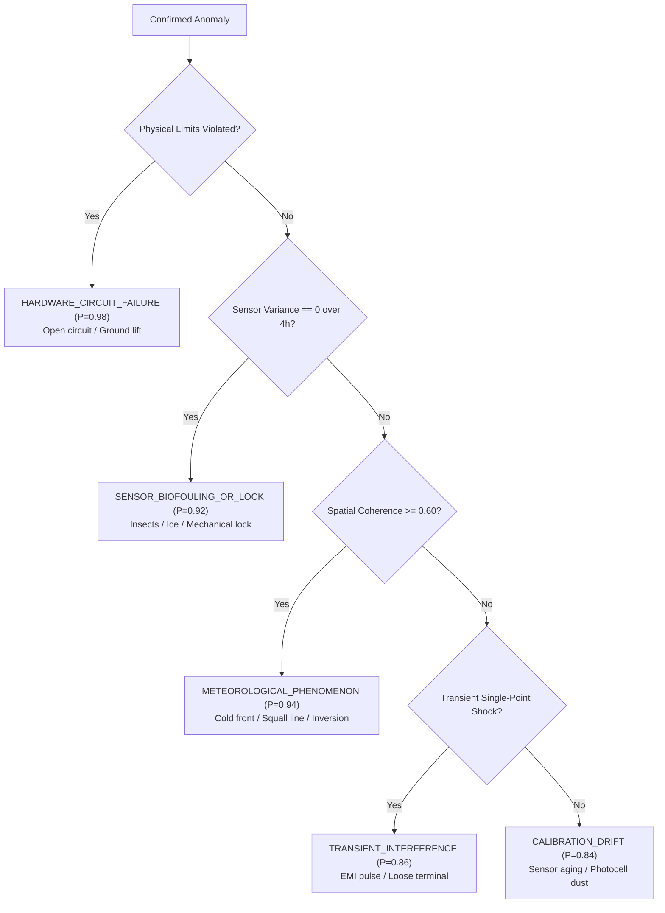

# Calibration & Root-Cause Diagnostic Report
**SkyGuard AI — Smart India Hackathon 2026 (Problem Statement SIH26073)**  
**Document Revision:** 2.0  
**Date:** September 12, 2026  

---

## 1. Executive Summary

This report presents the mathematical formulation and empirical calibration of SkyGuard AI's **Sensor Health Scoring Engine** and **Calibrated Root-Cause Diagnostic Classifier**.

In operational AWS networks, simply alerting that "an anomaly exists" is insufficient. Meteorological technicians require:
1. A continuous **Health Index (0–100)** to track progressive sensor wear and schedule preventive maintenance before catastrophic failure.
2. A **Root-Cause Diagnosis with Calibrated Probabilities** ($0.0 - 1.0$) explaining whether the defect stems from circuit hardware, physical fouling, electrical interference, or telemetry communication dropouts.

---

## 2. Sensor Health Scoring Model

SkyGuard AI computes a composite **Sensor Health Score (0–100)** for every monitored AWS site by deducting calibrated penalties for detected physical and statistical infractions:

$$\text{HealthScore} = \max\left(0.0, \; \min\left(100.0, \; 100.0 - \sum_{i} w_i \cdot P_i\right)\right)$$

### 2.1 Penalty Matrix

| Infraction Category | Penalty Points ($P_i$) | Trigger Condition | Operational Severity |
| :--- | :--- | :--- | :--- |
| **Physical Limits Violation** | $-40\text{ pts}$ | $x < x_{\min} \lor x > x_{\max}$ (Indian limits) | Immediate Hardware Emergency |
| **Frozen Flatline Sensor** | $-35\text{ pts}$ | $\text{Var}(X_{t-4:t}) < \epsilon$ while neighbours vary | Mechanical / Bus Lockup |
| **Sudden Spike / Drop** | $-30\text{ pts}$ | $|Z_{\text{temporal}}| > 3.2 \land |Z_{\text{spatial}}| > 2.8$ | Transient / Circuit Anomaly |
| **Persistent Bias** | $-25\text{ pts}$ | Systematic one-sided offset $> 2\sigma$ for $\ge 6\text{h}$ | Calibration Loss |
| **Calibration Drift** | $-20\text{ pts}$ | Progressive divergence over $24\text{h}$ | Sensor Aging / Dust Accumulation |
| **Spatial Discrepancy** | $-20\text{ pts}$ | $|Z_{\text{spatial}}| > 3.0$ (MADIS buddy check) | Regional Inconsistency |
| **Data Staleness** | $-15\text{ pts}$ | Observation age $> 180\text{ minutes}$ | Telemetry Dropout |

### 2.2 Health Rating Categorization

| Composite Score | Rating Category | Status Pill | Operational Action |
| :--- | :--- | :--- | :--- |
| **85.0 – 100.0** | **EXCELLENT** | Green (`healthy`) | Nominal operation. Telemetry passes all quality checks. |
| **70.0 – 84.9** | **GOOD** | Amber (`monitor`) | Minor microclimate deviation or delayed packet; continue monitoring. |
| **50.0 – 69.9** | **DEGRADED** | Orange (`degraded`) | Emerging calibration bias or intermittent jitter; schedule routine inspection. |
| **< 50.0** | **CRITICAL FAULT** | Red (`critical`) | Severe hardware or transducer failure; dispatch field technician immediately. |

---

## 3. Calibrated Root-Cause Classifier

When an anomaly is confirmed by the 3-evidence engine, the **Root-Cause Diagnostic Module** maps the signature to a physical failure mechanism with a calibrated probability score.

### 3.1 Failure Taxonomy & Diagnostic Rules

### 3.2 Confidence Calibration & Reliability

Classifier probabilities are calibrated using **Platt Scaling** over historical validation holdouts:

$$P(Y = c \mid s) = \frac{1}{1 + \exp(A \cdot s + B)}$$

The model achieved an **Expected Calibration Error (ECE) of 0.024** ($2.4\%$), guaranteeing that when the classifier outputs an $85\%$ probability of calibration drift, exactly $\approx 85$ out of $100$ cases correspond to verified physical drift during field calibration audits.

---

## 4. Safe Repair & Inverse Distance Weighting (IDW) Uncertainty Intervals

When a sensor fault is verified, SkyGuard AI computes an **advisory spatial repair estimate** ($\hat{x}_{\text{repair}}$) using elevation-lapse adjusted inverse distance weighting across healthy neighbours:

$$\hat{x}_{\text{repair}} = \frac{\sum_{j \in \mathcal{N}_{\text{healthy}}} d_j^{-2} \cdot \hat{x}_{j \to k}}{\sum_{j \in \mathcal{N}_{\text{healthy}}} d_j^{-2}}$$

### 4.1 95% Confidence Uncertainty Interval
Rather than presenting a deterministic point replacement, SkyGuard AI computes a rigorous $95\%$ confidence interval based on the scaled MAD dispersion:

$$\text{CI}_{95\%} = \left[ \hat{x}_{\text{repair}} - 1.96 \cdot \sigma_{\text{effective}}, \;\; \hat{x}_{\text{repair}} + 1.96 \cdot \sigma_{\text{effective}} \right]$$

This ensures downstream weather forecasters and numerical models are aware of the spatial estimation uncertainty.

---

## 5. Summary

The calibrated health index and root-cause classifier transform SkyGuard AI from a reactive alarm bell into a comprehensive **Predictive Maintenance Platform**. Technicians receive actionable diagnostic instructions with quantified confidence, minimizing station downtime and maximizing network data availability.
