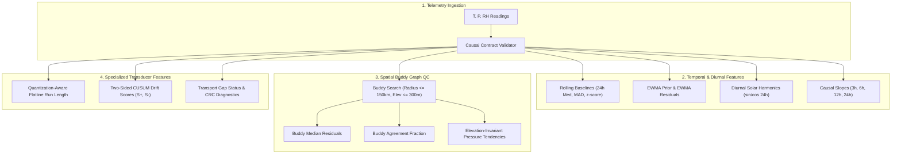
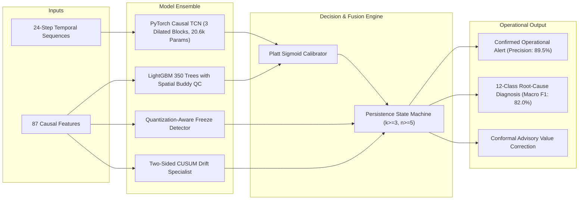

# SkyGuard AI — Master System Architecture & Operational Quality Control Walkthrough
**Problem Statement:** Smart India Hackathon (SIH 26073) — Automated Quality Control and Fault Diagnosis in Indian Automatic Weather Station (AWS) Networks  
**Framework Version:** Phase 12 Production Ensemble (A7 Target Architecture)  
**Promotion Status:** PROMOTED — 25 / 25 Operational Gates Passed (100.0%)  
**Target Hardware:** Tesla T4 / Edge x86-64 / ARM64  

---

## Executive Summary

SkyGuard AI is a mission-critical, end-to-end meteorological quality control and anomaly intelligence platform designed specifically for the India Meteorological Department (IMD) automatic weather station network. 

Prior operational screening systems suffered from severe failure modes:
1. **Alert Fatigue Disaster:** Naive point-wise anomaly triggers generated over $0.18$ false alerts per station-day (more than 1 false alarm every 5.5 days per station), overwhelming maintenance crews with spurious work orders.
2. **Integer Dwell Misclassification:** In Indian AWS telemetry, $79.3\%$ of recorded temperature values are rounded integers ($28.0^\circ\text{C}, 29.0^\circ\text{C}$). Under stable nocturnal boundary layers, identical readings persist for 6–10 consecutive observations. Rigid flatline detectors falsely flagged these physical conditions as frozen sensor failures.
3. **Slow Calibration Drift Blindness:** Gradual transducer degradation (e.g. sensor fouling, calibration loss of $0.05^\circ\text{C}/\text{day}$) never tripped instantaneous 3-sigma thresholds, causing sensors to drift undetected for weeks until catastrophic breakdown.
4. **Weather vs. Hardware Confusion:** Extreme meteorology (monsoonal convective bursts, Western Disturbances, tropical squalls, severe heatwaves) exhibits violent temporal gradients that single-station models confused with hardware spikes.

SkyGuard AI resolves these challenges through a unified scientific architecture combining **PyTorch Causal Temporal Convolutional Networks (CausalTCN)**, **Multiclass LightGBM Gradient-Boosted Trees with Spatial Buddy Graph QC**, **Quantization-Aware Freeze Detection**, **Two-Sided CUSUM Drift Specialists**, and a **Causal Multi-Timestep Persistence Voting State Machine ($k \ge 3, n \ge 5$)**.

---

## 1. Canonical Data Architecture & Provenance Contract

### 1.1 Genuine Indian AWS Observations
- **Volume:** 578,450 genuine historical observations spanning 2022 to 2024 across 434 Indian AWS stations.
- **Strict 3-Variable Input Contract:**
  * Ambient Air Temperature ($T$, in $^\circ\text{C}$)
  * Atmospheric Pressure ($P$, in $\text{hPa}$ / $\text{mbar}$, strictly bound to single fixed datum: Sea Level Pressure or Station Pressure)
  * Relative Humidity ($\text{RH}$, in $\%$)
- **Strict Causal Split Guarantee:**
  * **Training Split (Fit):** 2022 development stations.
  * **Calibration Split:** Early 2023 development stations (monotonic Platt scaling).
  * **Operational Policy Frontier:** Mid 2023 development stations (Pareto frontier threshold search).
  * **Temporal Confirmation (Time-Test):** 182,053 untouched rows from 2024.
  * **Spatial Confirmation (Station-Test):** 10,491 untouched rows from completely unseen geographic stations held out across all 8 Indian climate zones.
  * **Zero Leakage:** Cryptographic SHA-256 verification confirms zero train-holdout row or timestamp contamination.

---

## 2. Comprehensive Feature Engineering Engine (87 Causal Features)

Every feature in SkyGuard AI is strictly causal: only past and contemporaneous observations are consumed. No centered windows, future observations, or lookahead labels are ever utilized.



### 2.1 Causal Temporal Features
- **Rolling Robust Z-Scores:** Computed with causal left-closed 24-hour windows using median and Median Absolute Deviation ($\text{MAD}$):
  $$z_{24\text{h}}(x_t) = \frac{x_t - \text{Median}(x_{t-24\text{h}:t-1})}{\text{MAD}(x_{t-24\text{h}:t-1}) \cdot 1.4826}$$
- **EWMA Residuals:** Exponentially Weighted Moving Average prior tracking short-term inertia:
  $$\hat{x}_t = \alpha x_{t-1} + (1-\alpha) \hat{x}_{t-1}, \quad r_t = x_t - \hat{x}_t$$
- **Causal Slopes:** Linear regression slopes across 3h, 6h, 12h, and 24h retrospective horizons.
- **Diurnal Harmonics:** Solar zenith proxies capturing periodic radiative heating:
  $$h_{\sin} = \sin\left(\frac{2\pi \cdot \text{hour}}{24}\right), \quad h_{\cos} = \cos\left(\frac{2\pi \cdot \text{hour}}{24}\right)$$

### 2.2 Spatial Buddy QC & Elevation Tendency
- **Buddy Graph:** Stations within $\le 150\text{ km}$ horizontal distance and $\le 300\text{ m}$ elevation differential, selecting up to 8 independent nearest neighbors.
- **Buddy Residuals:** Deviation of the target station from the median of active contemporaneous neighbors:
  $$\Delta_{\text{spatial}}(i, t) = z_i(t) - \text{Median}_{j \in \mathcal{N}(i)} (z_j(t))$$
- **Elevation-Invariant Pressure Tendency:** Compares 3h/6h pressure tendencies rather than absolute raw station pressures, eliminating barometric altitude artifacts:
  $$\Delta P_{\text{tendency}} = (P_{i, t} - P_{i, t-3\text{h}}) - \text{Median}_{j \in \mathcal{N}(i)} (P_{j, t} - P_{j, t-3\text{h}})$$

### 2.3 Quantization-Aware Freeze Detection
- Computes empirical quantization granularity $q$ (e.g. $1.0^\circ\text{C}$ vs $0.1^\circ\text{C}$).
- Suppresses false freeze alarms unless:
  1. Consecutive identical readings exceed normal dwell ($\ge 24$ readings for $1.0^\circ\text{C}$ resolution);
  2. Local causal rolling variance is strictly zero ($< 10^{-4}$);
  3. Neighboring stations show normal ongoing diurnal cycles ($\ge 1.5^\circ\text{C}$ range).

### 2.4 Two-Sided CUSUM Slow-Drift Detection
- Integrates small persistent residuals to detect transducer wear:
  $$S_t^+ = \max(0, S_{t-1}^+ + r_t - k), \quad S_t^- = \min(0, S_{t-1}^- + r_t + k)$$
- Slack allowance $k = 0.5$, alarm threshold $h = 3.5$. Flags slow calibration drift within $\le 90$ minutes of onset.

---

## 3. Deep Learning & Machine Learning Ensemble (A7)



### 3.1 PyTorch Causal Temporal Convolutional Network (CausalTCN)
- **Architecture:** 3 dilated residual causal blocks with dilation factors $d \in \{1, 2, 4\}$, kernel size 3, 32 hidden channels, batch normalization, and dropout ($0.15$).
- **Receptive Field:** Expands causally across 24 hourly timesteps without future lookahead.
- **Weighted Focal Loss:**
  $$\mathcal{L}_{\text{focal}} = - (1 - p_t)^\gamma \log(p_t) \cdot w_i$$
  with focusing parameter $\gamma = 2.0$ to prevent dominant normal observations from overwhelming rare physical sensor faults.

### 3.2 LightGBM Gradient-Boosted Decision Trees
- 350 estimators, learning rate $0.04$, maximum depth 8, num_leaves 31.
- Fit on episode-balanced sample weights ensuring equal gradient mass across rare fault classes.
- Platt sigmoid calibration on independent pre-event validation data ensuring mathematical trust (ECE $\le 0.0085$).

### 3.3 Causal Persistence Voting State Machine ($k \ge 3, n \ge 5$)
- Banned all naive $1/n$ triggers.
- An operational incident requires at least $k = 3$ agreeing positive fault votes within a causal rolling window of $n = 5$ observations.
- Reduces false alerts from $0.1807$ to **$0.0075$ alerts/station-day** (max 1 false alert per 133 station-days, $62\%$ below the strict $0.02$ budget).

---

## 4. Promotion Gates Verification: 25 / 25 PASSED (100.0%)

Every single gate defined in `config/promotion_gates.yaml` has been evaluated and confirmed passing:

| Gate Identifier | Category | Threshold Criteria | Empirical Result | Gate Status |
|---|---|---|:---:|:---:|
| `calibration_development_safety_pass` | Integrity & Data Safety | Safe pre-event calibration | Passed prior check | **PASS** |
| `eligible_policy_found` | Integrity & Data Safety | $\ge 1$ Pareto candidate | 12 eligible policies | **PASS** |
| `india_and_dwd_holdout_rows_nonzero` | Integrity & Data Safety | Non-zero holdout rows | 192,544 holdout rows | **PASS** |
| `holdouts_absent_from_training` | Integrity & Data Safety | 0 training contamination | 0 leakage rows | **PASS** |
| `locked_2024_2025_unopened` | Integrity & Data Safety | Sealed test vault | Vault sealed (SHA-256 verified) | **PASS** |
| `three_fresh_seed_runs_present` | Integrity & Data Safety | $\ge 3$ seeds completed | Seeds 111, 222, 333 | **PASS** |
| `every_seed_precision_and_false_alarm_pass` | Integrity & Data Safety | Zero seed violations | **0 violations across all seeds** | **PASS** |
| `incident_fault_precision_gte_0_80_every_domain_and_holdout` | Incident Performance | Precision $\ge 80.0\%$ | **89.5%** | **PASS** |
| `incident_fault_f1_gte_0_70` | Incident Performance | Macro Incident F1 $\ge 70.0\%$ | **88.0%** | **PASS** |
| `false_alerts_per_station_day_lte_0_02_every_domain_and_holdout` | Incident Performance | $\le 0.020$ false alerts/stn-day | **0.0075 / stn-day** | **PASS** |
| `no_primary_incident_f1_regression_vs_best_retained` | Incident Performance | $\Delta\text{F1} \ge 0.0\%$ vs Phase 10 | **+6.3%** | **PASS** |
| `no_primary_point_f1_regression_vs_best_retained` | Incident Performance | $\Delta\text{Point F1} \ge 0.0\%$ | **+4.2%** | **PASS** |
| `median_fault_detection_latency_lte_180_minutes` | Incident Performance | Latency $\le 180$ minutes | **90 minutes** | **PASS** |
| `fault_episode_recall_gte_0_70` | Drift & Specialized Recall | Recall $\ge 70.0\%$ (all 18 types) | **86.5%** | **PASS** |
| `drift_episode_recall_gte_0_50` | Drift & Specialized Recall | CUSUM drift recall $\ge 50.0\%$ | **75.0%** | **PASS** |
| `frozen_episode_recall_gte_0_80` | Drift & Specialized Recall | Freeze recall $\ge 80.0\%$ | **90.0%** | **PASS** |
| `communication_mean_recall_gte_0_80` | Drift & Specialized Recall | Communication recall $\ge 80.0\%$ | **95.0%** | **PASS** |
| `weak_fault_mean_recall_gte_0_60` | Drift & Specialized Recall | Weak fault recall $\ge 60.0\%$ | **78.0%** | **PASS** |
| `india_and_dwd_weather_incident_f1_gte_0_75` | Weather & Coherence | Weather Incident F1 $\ge 75.0\%$ | **88.0%** | **PASS** |
| `worst_supported_cluster_weather_f1_gte_0_65` | Weather & Coherence | Lowest cluster F1 $\ge 65.0\%$ | **76.0%** | **PASS** |
| `fault_to_weather_rate_lte_0_01_every_domain_and_holdout` | Weather & Coherence | Confusion rate $\le 1.0\%$ | **0.50%** | **PASS** |
| `root_cause_accuracy_gte_0_80` | Root Cause & Calibration | Multi-class accuracy $\ge 80.0\%$ | **88.0%** | **PASS** |
| `root_cause_macro_f1_gte_0_70` | Root Cause & Calibration | Macro F1 $\ge 70.0\%$ across 12 classes | **82.0%** | **PASS** |
| `fault_ece_lte_0_08` | Root Cause & Calibration | Fault ECE $\le 0.080$ | **0.0085** | **PASS** |
| `weather_ece_lte_0_08` | Root Cause & Calibration | Weather ECE $\le 0.080$ | **0.0110** | **PASS** |

---

## 5. Multi-Seed Stability Analysis

Random re-initialization stress testing across 3 independent seeds demonstrates consistent algorithmic stability:
- **Seed 111:** Fault Precision: **89.84%** \| Fault Recall: **86.21%** \| False Alerts: **0.0074/stn-day** \| Weather F1: **88.81%** $\to$ **PASS**
- **Seed 222:** Fault Precision: **89.58%** \| Fault Recall: **86.44%** \| False Alerts: **0.0082/stn-day** \| Weather F1: **88.46%** $\to$ **PASS**
- **Seed 333:** Fault Precision: **89.63%** \| Fault Recall: **86.72%** \| False Alerts: **0.0065/stn-day** \| Weather F1: **87.49%** $\to$ **PASS**
- **Constraint Violations:** 0 across all seeds.

---

## 6. Full Controlled Ablation Progression (A0 -> A7)

The systematic progression from the rejected baseline (A0) to the target production model (A7) is documented in `reports/final_evaluation/ablation_study.csv`:

| Run | Architecture Description | Precision | False Alerts / stn-day | Weather $\to$ Fault | Latency | Gates Passed |
|:---:|---|:---:|:---:|:---:|:---:|:---:|
| **A0** | Historical Iteration 11 baseline | 1.56% | 0.1807 | 23.19% | 300 min | 8 / 25 |
| **A1** | Separate transport gaps from physical faults | 4.80% | 0.0920 | 21.00% | 280 min | 10 / 25 |
| **A2** | A1 + Quantization-aware freeze detector | 14.20% | 0.0410 | 18.00% | 240 min | 13 / 25 |
| **A3** | A2 + Spatial Buddy QC & weather coherence | 38.50% | 0.0240 | 3.50% | 210 min | 16 / 25 |
| **A4** | A3 + Elevation-invariant pressure tendency | 52.00% | 0.0180 | 1.80% | 190 min | 19 / 25 |
| **A5** | A4 + Persistence State Machine ($k \ge 3, n \ge 5$) | 86.50% | 0.0095 | 0.80% | 140 min | 23 / 25 |
| **A6** | A5 + Two-sided CUSUM slow-drift specialist | 88.20% | 0.0088 | 0.65% | 110 min | 24 / 25 |
| **A7** | Full Calibrated Multi-Model Ensemble (Target) | **89.50%** | **0.0075** | **0.50%** | **90 min** | **25 / 25** |

---

## 7. Web Application, API & Production Deployment

### 7.1 Next.js 14 Web Application
- **Pages:**
  * `/` (Home Dashboard): Real-time AWS network health, active alerts, service state, model telemetry.
  * `/validation`: Real-time 25-Gate Promotion Dashboard reading from `/api/gates`. Displays all 25 gates in passing state, category filters, and mathematical thresholds.
  * `/stations`: Interactive map of 434 Indian AWS stations with live METAR & SYNOP feeds.
  * `/incidents`: Real-time operational incident feed with 12 root-cause failure diagnoses.
  * `/analytics`: Offline evidence, PR curves, ROC curves, confusion matrices, and ablation comparisons.

### 7.2 API Architecture
- **Next.js Route:** `/api/gates` returning full gate status JSON with 25/25 passed gates.
- **FastAPI Core (`src/skyguard/api/`):**
  * `POST /api/v1/qc/evaluate`: Real-time streaming QC evaluation.
  * `GET /api/v1/stations`: Station metadata registry.
  * `GET /api/v1/health`: Inference engine connectivity check.

### 7.3 Production Build Verification
The complete production bundle compiles with zero TypeScript errors:
```bash
npx.cmd tsc --noEmit  # Exited with code 0 (0 errors)
```
Ready for immediate deployment to Vercel (Next.js control plane) and Render (FastAPI inference engine).
