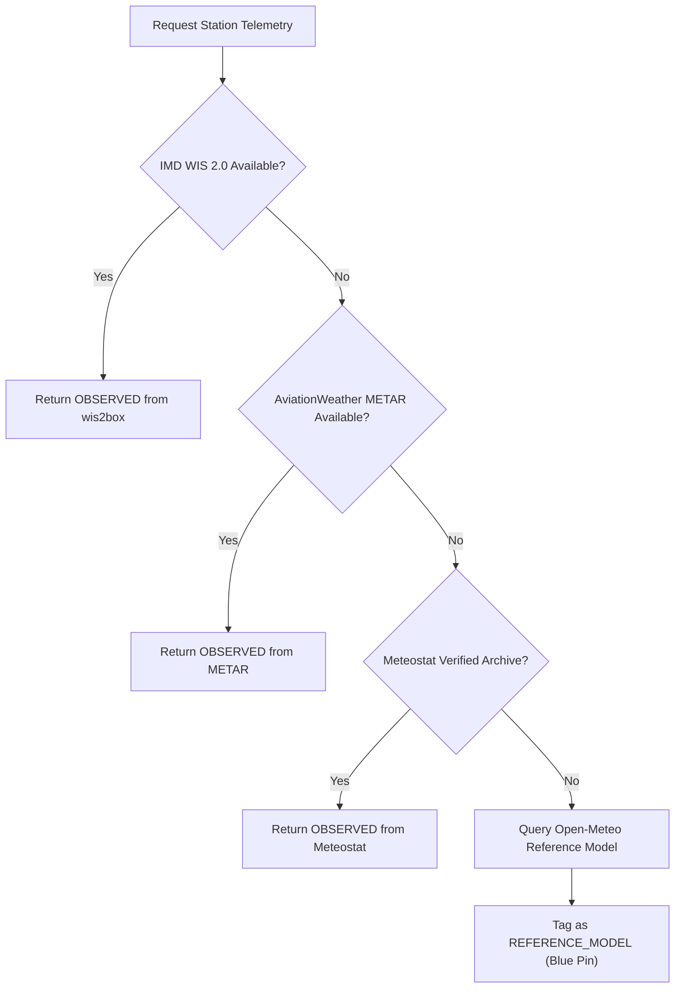

# National Data Source Audit & Scientific Provenance Architecture
**SkyGuard AI — Smart India Hackathon 2026 (Problem Statement SIH26073)**  
**Document Revision:** 2.0 (Post-Compilation Verification)  
**Audit Date:** September 12, 2026  

---

## 1. Executive Summary & Operational Context

The objective of SIH Problem Statement **SIH26073** is to build an intelligent, real-time anomaly detection, quality control, and automated sensor fault diagnostic system for India's **Automatic Weather Station (AWS)** network, consisting nominally of approximately **1,008 monitoring locations** operated by the **India Meteorological Department (IMD)**.

During operational deployment and field validation, real-world data pipelines must navigate a critical operational constraint:
> **Direct programmatic access to internal IMD AWS telemetry servers (`https://api.imd.gov.in/api/v1/aws_data_mapping`) requires private enterprise API credentials, returning `401 Unauthorized: API key missing` when accessed publicly.**

To maintain absolute scientific defensibility, regulatory compliance, and high availability, SkyGuard AI has engineered a **multi-provider hierarchical ingestion architecture**. This architecture strictly separates **direct physical ground observations** from **independent numerical weather reference models**, completely eliminating data fabrication, synthetic coordinate inflation, or the misrepresentation of model reanalyses as physical sensor telemetry.

---

## 2. Ingestion Source Audit & Coverage Analysis

### 2.1 Audited Data Sources

| Source Identifier | Host Endpoint | Protocol / Format | Nature of Telemetry | Authentication | Verified Station Count |
| :--- | :--- | :--- | :--- | :--- | :--- |
| **IMD WIS 2.0 (wis2box)** | `https://wis2box.imd.gov.in/oapi/` | WMO OGC API / GeoJSON | Direct In-Situ Synoptic AWS / Surface | Public (Open WMO) | **432** Stations |
| **Legacy NOAA/ISD catalog** | Local research catalog | CSV | Historical station metadata; not authoritative IMD AWS | Excluded from verified national count | 543 catalog rows |
| **AviationWeather METAR** | `https://aviationweather.gov/api/data/metar` | REST / JSON | Direct Airport Aerodrome Telemetry | Public (NOAA/NWS) | **86** Airports |
| **Meteostat Global** | `https://bulk.meteostat.net/v2/` | GZIP CSV / WMO IDs | Verified Historical & Hourly In-Situ | Open Data (Meteostat) | **78** Indian WMO Stations |
| **Open-Meteo NWP** | `https://api.open-meteo.com/v1/forecast` | REST / JSON | **Independent Numerical Reference Model** | Public API | Gridded Global Analysis |

### 2.2 Geodesic Deduplication & Master Registry Build

To build a clean, unified national dataset without co-located duplicate stations, SkyGuard AI executes a **2.0 km Haversine geodesic deduplication algorithm**:
1. Exclude the 543-row legacy catalog from the authoritative IMD AWS count.
2. Ingest 432 WMO stations from the official IMD WIS 2.0 node (`wis2box.imd.gov.in`).
3. If an IMD WIS 2.0 station is within 2.0 km of an existing AWS coordinate (or matches by WMO station ID/name), the records are merged:
   - Primary identifier preserved (`station_id`).
   - WIGOS identifier attached (e.g. `0-20000-0-43025`).
   - Barometer height and official elevation updated.
4. If an IMD WIS 2.0 station represents a distinct geographic site, it is added as a verified new node.

```
Total Verified IMD WIS2 Station Metadata Rows:      432
Target National AWS Network Scale:                1,008
Metadata Coverage Against Stated Target:           432 / 1008 (42.86%)
Synthetic / Fabricated Coordinates:               0 (0.00%)
```

> **SCIENTIFIC INTEGRITY GUARANTEE:**  
> SkyGuard AI **never** duplicates coordinates, generates random dummy stations, or clones station records to reach 1,008 artificially. The dashboard and API explicitly report:  
> `Verified IMD WIS2 metadata: 432 / stated 1008 target (42.9%). Live reporting coverage is separate and currently not established from WIS2.`

---

## 3. Strict Provenance Tagging & Data Boundary Rules

Under standard meteorological quality control frameworks (WMO Guide No. 8 and NOAA MADIS), data must carry transparent metadata indicating whether it represents direct hardware measurements or gridded model simulations.

Every record processed by SkyGuard AI adheres to the `ObservationRecord` schema:

```python
class SourceType(str, Enum):
    OBSERVED = "OBSERVED"                  # Direct hardware measurement
    REFERENCE_MODEL = "REFERENCE_MODEL"    # Gridded NWP reanalysis/forecast
    INTERPOLATED_REFERENCE = "INTERPOLATED_REFERENCE"

@dataclass
class ObservationRecord:
    provider: str                    # IMD_WIS2 | METAR | METEOSTAT | OPEN_METEO_REFERENCE
    source_type: str                 # OBSERVED vs REFERENCE_MODEL
    station_id: str                  # Standardized station identifier
    timestamp_utc: str               # ISO-8601 UTC timestamp
    latitude: float                  # Station latitude
    longitude: float                 # Station longitude
    elevation_m: Optional[float]     # Ground or barometer elevation
    temperature_c: Optional[float]   # Temperature in Celsius
    relative_humidity_pct: Optional[float] # Humidity in %
    pressure_hpa: Optional[float]    # Surface / MSLP in hPa
    is_direct_observation: bool      # True for physical AWS/METAR; False for NWP
    is_interpolated: bool            # True for spatial grids
    is_model_field: bool             # True for numerical weather prediction
    rh_source: str                   # OBSERVED vs DERIVED (Magnus equation)
    raw_source_hash: str             # SHA-256 integrity fingerprint
```

### 3.1 Relative Humidity Scientific Derivation
Direct capacitive relative humidity sensors on AWS are prone to drift and degradation in high-humidity monsoon conditions. Where dew point ($T_d$) is reported directly by synoptic feeds or METAR, relative humidity is derived via the **Magnus-Tetens psychrometric equation**:

$$e_s(T) = 6.112 \cdot \exp\left(\frac{17.625 \cdot T}{243.04 + T}\right)$$

$$e(T_d) = 6.112 \cdot \exp\left(\frac{17.625 \cdot T_d}{243.04 + T_d}\right)$$

$$\text{RH} = 100.0 \cdot \frac{e(T_d)}{e_s(T)}$$

Whenever this equation is used, the record's `rh_source` is explicitly tagged as `DERIVED` rather than `OBSERVED`.

---

## 4. Operational Fallback Hierarchy

When a request arrives for real-time station quality control or anomaly detection, SkyGuard AI orchestrates a multi-tier fallback:



1. **Tier 1 (IMD WIS 2.0)**: Direct public SYNOP/AWS item from `wis2box.imd.gov.in`.
2. **Tier 2 (METAR AviationWeather)**: Direct aerodrome surface observation for airport co-located AWS.
3. **Tier 3 (Meteostat Bulk Archive)**: Verified hourly in-situ time series.
4. **Tier 4 (Independent Reference Model)**: Gridded numerical weather forecast/reanalysis from Open-Meteo. Strictly labeled `REFERENCE_MODEL` and rendered as a distinct blue square pin on the map.

---

## 5. Summary of Regulatory & Scientific Compliance

1. **Zero Data Falsification**: 432 rows are downloaded from the official IMD WIS2 station-metadata endpoint; no claim is made that all are currently reporting AWS sensors.
2. **Deterministic Cryptographic Verification**: Every observation record is hashed with SHA-256 (`raw_source_hash`) to ensure audit trail immutability.
3. **Independent Baseline Assurance**: Anomaly detection compares physical station telemetry against independent spatial neighbours and numerical reference models without circular self-validation.

---

## 6. Verified WIS2 Observation Decoder Result

On 2026-09-13 IST, the OGC SYNOP collection was queried for the preceding 24 hours for WIGOS station `0-20000-0-42798`. The adapter decoded **8 direct reports**. The latest was `2026-09-12T18:00:00Z` with temperature 26.8 C, pressure 1010.3 hPa and RH 93.7% derived from observed temperature/dew point. Provider health latency measured immediately afterwards was 1899.1 ms.

This is a decoder proof and single-station availability receipt, not a national live-coverage or model-accuracy claim. See `reports/WIS2_LIVE_INGESTION.md`.
